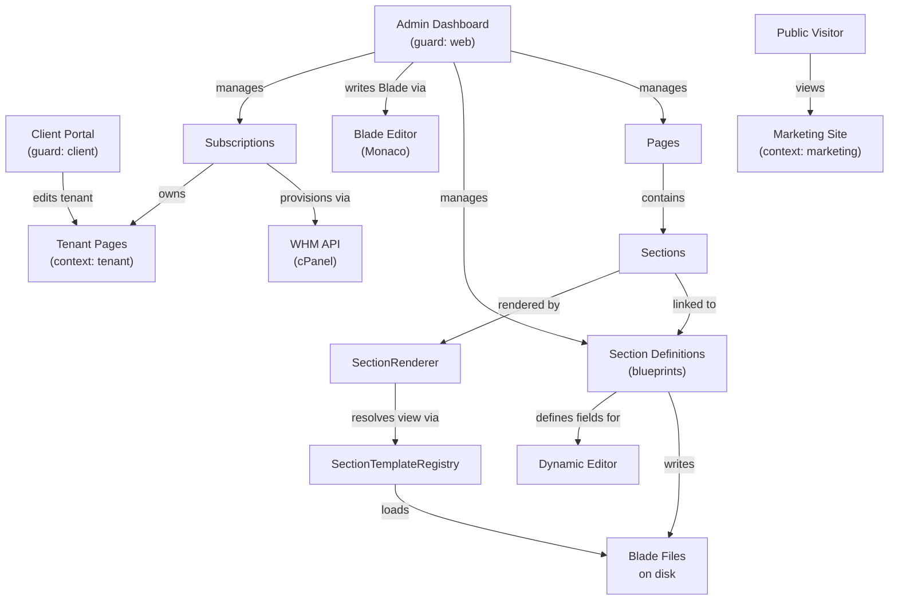

# Palgoals — Project Overview

> **Last Updated:** 2026-06-15 · **Status:** Verified

## Purpose

This document is the entry point for any developer or AI session working on the Palgoals codebase. It answers the questions: *what is this system*, *who uses it*, and *how do its major parts fit together*.

---

## What Is Palgoals?

Palgoals is a **custom Laravel 12 Website Builder and Content Platform**. It is not WordPress, not a plugin-based CMS, and not a drag-and-drop page builder. It is a purpose-built application where content structure, field definitions, and rendering templates are all managed directly from the admin panel — without touching code.

The platform has four interconnected surfaces:

- A **public marketing website** rendered from a managed Page + Section system
- An **admin dashboard** for managing content, clients, subscriptions, plans, and templates
- A **client portal** where customers manage their own subscription and tenant site pages
- A **tenant site system** where each client subscription gets its own set of pages and sections

---

## Product Vision

Palgoals is designed around one principle: **content structure and presentation should be configurable from the admin panel, not from the codebase**.

The long-term goal is that a developer sets up a section type once — defines its fields, writes its Blade template from the browser, and links it to a template key — and from that point forward, editors manage all content through the admin UI without touching PHP or Blade files again.

This drives three key design decisions:

1. **Section Definitions over hardcoded types** — new section types are created as database records, not code. Field schema, editor mode, and Blade source are all stored in the DB.
2. **Definition-driven rendering** — `SectionRenderer` resolves templates from `SectionTemplateRegistry` rather than from type-switch logic, so adding a new section type does not require modifying the renderer.
3. **Multi-tenant by subscription** — each client gets their own set of pages (`context = tenant`) that are isolated from the marketing site and from other clients, without requiring separate application instances.

---

## Tech Stack

| Layer | Technology |
|-------|-----------|
| Backend | PHP 8.2+, Laravel 12, Eloquent ORM |
| Frontend | Tailwind CSS 4, Alpine.js, GSAP, Axios, SortableJS |
| Editor | Monaco Editor (Blade editor), CKEditor 5 (rich text) |
| Auth | Laravel Fortify (`web` guard for admins, `client` guard for clients) |
| Database | MySQL — host `127.0.0.1:3306`, DB `palgoalsnewtest1` |
| Localization | Custom `t()` function — translations stored in `translation_values` table |
| Asset Build | Vite |
| Testing | Pest + Laravel test runner |

---

## Who Uses the System?

Three distinct user types, each with a separate authentication guard and interface:

```
┌─────────────────────────────────────────────────────────────┐
│  Admin (guard: web)                                         │
│  → Manages everything: pages, sections, clients,            │
│    subscriptions, plans, templates, media, translations     │
├─────────────────────────────────────────────────────────────┤
│  Client (guard: client)                                     │
│  → Manages their own subscription, domain, and tenant site  │
│    pages via the client portal                              │
├─────────────────────────────────────────────────────────────┤
│  Public Visitor (unauthenticated)                           │
│  → Views the marketing website, browses templates, submits  │
│    testimonials, checks out plans                           │
└─────────────────────────────────────────────────────────────┘
```

---

## Major Components

### Core Platform

| Component | What It Does | Primary Location |
|-----------|-------------|-----------------|
| **Marketing Site** | Public-facing pages rendered from Page + Section records | `app/Http/Controllers/Front/` |
| **Admin Dashboard** | Full management interface for admins | `app/Http/Controllers/Admin/` |
| **Client Portal** | Client's subscription and site management | `app/Http/Controllers/Client/` |
| **Page Builder** | Structured sections editor (no drag-and-drop) | `app/Http/Controllers/Admin/SectionController.php` |
| **Section Definitions** | Dynamic section type registry — blueprint system | `app/Support/Sections/`, `app/Models/Sections/` |
| **Blade Editor** | Monaco-based in-admin Blade file writer | `SectionTemplateFileWriter`, `edit.blade.php` |
| **Subscriptions** | Hosting plan purchases and lifecycle | `app/Models/Tenancy/Subscription.php` |
| **Media Library** | Centralized media picker used across the admin | `app/Models/Media.php`, `MediaController.php` |
| **Locale System** | Multi-language support via `t()` function | `app/helpers.php`, `translation_values` table |

### External Integrations

| Integration | Purpose | Entry Point |
|-------------|---------|------------|
| **WHM API (cPanel)** | Provisions and manages hosting accounts on remote servers | `app/Http/Controllers/Admin/Management/ServerController.php` |
| **Domain Provisioning** | DNS verification, SSL state tracking, domain lifecycle | `app/Models/Domain.php`, `DomainVerificationProbeController` |

---

## Core Concepts Explained

### Page

A `Page` is the top-level content container. Every page belongs to a `context`:

- `marketing` — pages on the public website, managed by admin
- `tenant` — pages belonging to a client's subscription site

A page has:
- Translations (title, slug, meta) per language
- An ordered collection of `Section` records
- A flag `is_home` to mark it as the homepage

### Section

A `Section` is a content block inside a page — for example: a hero, a features grid, a pricing table.

Each section has:
- A `section_type` string (e.g. `hero_main`, `services_grid`)
- A foreign key `section_definition_id` linking it to its **SectionDefinition** blueprint
- `SectionTranslation` records storing the localized JSON content for each language

### SectionDefinition

A `SectionDefinition` is a **blueprint** that describes what a section type looks like — its fields, their types, their scopes, and which Blade template renders it.

This is the core of the dynamic system. Definitions are created from the admin panel and do **not** require code changes. A definition has:
- `section_key` — unique identifier (e.g. `hero_main`)
- `category` — groups related sections (e.g. `hero`, `services`)
- `editor_mode` — `dynamic` (fully managed fields) or `custom_preset` (legacy custom editor)
- `blade_source` — the Blade template code stored in the database
- `blade_written_at` — timestamp of the last disk write

### Blade Editor

A developer-facing feature inside the admin panel that allows writing and saving Blade template code directly in the browser using Monaco Editor, without accessing the server filesystem.

The written code is stored in `blade_source` in the database and simultaneously written to:
```
resources/views/front/sections/{category}/{section_key}.blade.php
```

This is handled by `SectionTemplateFileWriter`. The workflow is documented in `docs/07-section-definitions.md § Blade File Writer`.

### Dynamic Editor

When `editor_mode = dynamic`, sections linked to that definition display a **field-by-field editor** in the admin panel — instead of a raw textarea. Each field is rendered according to its type (text, media, repeater, etc.) and scope (shared across languages or translatable per language).

This is handled by `DynamicSectionEditorRenderer`, which builds a structured payload from the definition's fields and the section's saved content.

---

## System Architecture Diagram



---

## What Is NOT Active (Archived Systems)

The following systems existed in earlier development phases but have been **archived** and are not part of the active runtime:

| System | Status | Notes |
|--------|--------|-------|
| **Visual Builder (GrapesJS)** | 🗄️ Archived | Drag-and-drop editor, removed from active runtime. Code exists in `legacy/visual-builder/` but is not used. |
| **`builder_mode`** field | 🗄️ Archived marker | Field still exists on `pages` table as a dormant state marker, but no longer drives rendering behavior. |
| **`custom_preset` editor** | ⚠️ Not in active editor path | `editor_mode = custom_preset` definitions exist but are not rendered via the dynamic editor UI. |
| **Legacy section renderer** | ⚠️ Fallback only | `LEGACY_FRONTEND_SECTION_TYPES` in `SectionRenderer` still handles old section types as a fallback, but new sections should not use this path. |

---

## Request Flow Summary

### Public Marketing Page

```
GET /some-page
  → Front\PageController@show
  → loads Page (context=marketing) + Sections
  → SectionRenderer::render() for each Section
    → tries definition-driven path first
    → resolves Blade view from SectionTemplateRegistry
    → falls back to legacy renderer if no definition found
  → returns HTML
```

### Admin: Edit a Section's Content

```
GET /admin/pages/{page}/sections/{section}/edit
  → Admin\SectionController@edit
  → SectionDefinitionRuntimeResolver resolves linked definition
  → DynamicSectionEditorRenderer builds field payload
  → Blade renders field-by-field editor
  → POST saves SectionTranslation records
```

### Admin: Write a Blade Template

```
POST /admin/section-definitions/{id}/write-blade
  → blade_source (base64-encoded) decoded in PHP
  → SectionTemplateFileWriter::write()
  → writes to resources/views/front/sections/{category}/{key}.blade.php
  → updates blade_written_at timestamp
```

---

## Where to Go Next

| Topic | Document |
|-------|----------|
| System architecture & layers | `docs/01-system-architecture.md` |
| Pages module | `docs/05-pages-module.md` |
| Sections module | `docs/06-sections-module.md` |
| Section Definitions system | `docs/07-section-definitions.md` |
| Blade Editor workflow | `docs/08-section-blade-editor.md` |
| Frontend rendering flow | `docs/09-rendering-flow.md` |
| Locale & translation system | `docs/04-locale-and-translations.md` |
| Developer setup & commands | `docs/21-developer-guide.md` |
| Coding standards & conventions | `docs/22-coding-standards.md` |
| Common errors & fixes | `docs/23-troubleshooting.md` |
