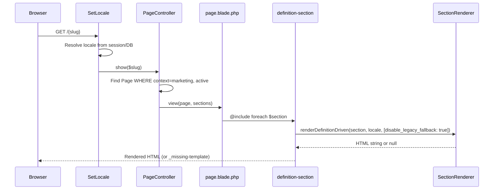
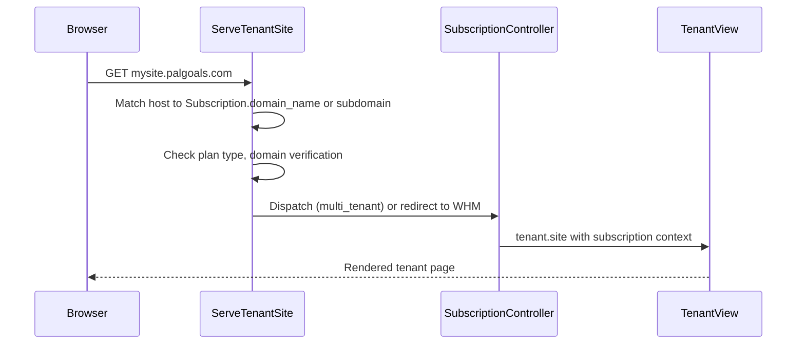
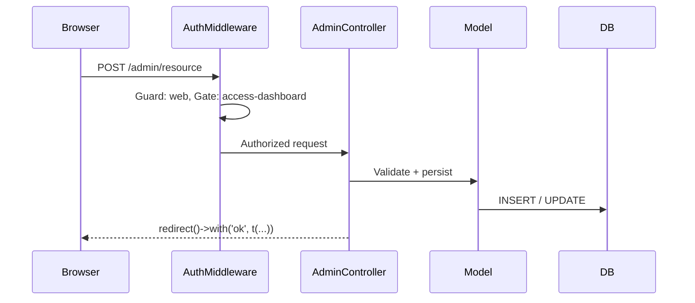

# System Architecture

> **Last Updated:** 2026-06-15 · **Status:** Verified against source code
> **Scope:** High-level architecture map. For render internals see [09-rendering-flow.md](./09-rendering-flow.md). For section definitions see [07-section-definitions.md](./07-section-definitions.md).

---

## Purpose

This document answers the question: *how is Palgoals built from an architectural standpoint?*

It is an **architecture map**, not a code reference. It covers layers, domain boundaries, data ownership, integration points, and extension seams. It deliberately does not repeat content covered in 07 or 09.

---

## Architectural Principles

Six design decisions shape every part of the codebase:

**1. Definition-Driven Design** — Site sections are not hardcoded. A `SectionDefinition` record describes what fields exist; a `Section` record holds the actual content. Blade views are written through a Monaco editor and stored on disk. See `07-section-definitions.md`.

**2. Two-Layer Content Model** — Every piece of public content separates *structure* (Page/Section records) from *presentation* (SectionDefinition + Blade view). Admin content and tenant content share the same model layer but different ownership contexts (`context: marketing` vs `context: tenant`).

**3. Multi-language First** — All user-visible text goes through `t()` (translations via `translation_values` table) or model translation tables (e.g. `page_translations`). Locale is resolved per request by `SetLocale` middleware from session/DB, not from URL prefixes.

**4. Guard Separation** — Two auth guards, `web` (admins using Laravel Fortify) and `client` (subscribers). They have entirely separate session stores, login flows, and controller namespaces. They cannot impersonate each other except via an explicit admin "Login As" action.

**5. Plan-Type Branching** — The platform supports two fundamentally different product modes. `TYPE_MULTI_TENANT` sites run inside the platform (pages cloned from templates, served by `ServeTenantSite`). `TYPE_HOSTING` sites run on external cPanel/WHM accounts (synced via WHM API, provisioned by `ProvisioningService`). Every provisioning and runtime code path branches on this constant.

**6. Graceful Fallbacks** — The render pipeline is designed so that a missing Blade view shows a diagnostic `_missing-template` block rather than a 500. The checkout flow has order-activation guards. Domain verification has per-status badge states. Nothing silently fails blank.

---

## Platform Layers

```
┌─────────────────────────────────────────────────────────────────┐
│  LAYER 1 — Public Marketing Site                                │
│  Routes: web.php (SetLocale middleware)                         │
│  Controllers: Front\PageController, Front\TemplateController  │
│  Views: front/pages/page.blade.php → definition-section.blade   │
└───────────────────────────┬─────────────────────────────────────┘
                            │ HTTP
┌───────────────────────────▼─────────────────────────────────────┐
│  LAYER 2 — Client Portal                                        │
│  Guard: client · Prefix: /client                                │
│  Controllers: Client\HomeController, SubscriptionController    │
│               SubscriptionPageEditorController                  │
│               InvoiceCheckoutController, DomainController       │
│  Views: client/site/, client/subscriptions/, client/invoices/   │
└───────────────────────────┬─────────────────────────────────────┘
                            │ HTTP
┌───────────────────────────▼─────────────────────────────────────┐
│  LAYER 3 — Admin Dashboard                                      │
│  Guard: web · Prefix: /admin                                    │
│  Middleware: auth, can:access-dashboard                         │
│  Controllers: Admin\*, Admin\Management\*                    │
│  Views: dashboard/*                                             │
└───────────────────────────┬─────────────────────────────────────┘
                            │ Host-based routing
┌───────────────────────────▼─────────────────────────────────────┐
│  LAYER 4 — Tenant Sites                                         │
│  Middleware: ServeTenantSite (host-based dispatch)              │
│  Identified by: subdomain or custom domain on Subscription      │
│  Serves: tenant.site view (multi-tenant) or WHM cPanel (hosting)│
└───────────────────────────┬─────────────────────────────────────┘
                            │
┌───────────────────────────▼─────────────────────────────────────┐
│  LAYER 5 — Section / Definition Engine                          │
│  SectionRenderer, SectionDefinitionRuntimeResolver              │
│  SectionTemplateRegistry, SectionQueryResolver                  │
│  (See 07-section-definitions.md + 09-rendering-flow.md)         │
└───────────────────────────┬─────────────────────────────────────┘
                            │
┌───────────────────────────▼─────────────────────────────────────┐
│  LAYER 6 — External Integrations                                │
│  WHM/cPanel API (ProvisioningService, SubscriptionSyncService)  │
│  Domain Registrars (Enom, Namecheap via RegistrarProvisioning)  │
│  Media Library (internal)                                       │
└─────────────────────────────────────────────────────────────────┘
```

---

## Domain Boundaries

The codebase organizes around five logical domains:

### 1. Content Domain
**Models:** `Page`, `PageTranslation`, `Section`, `SectionTranslation`, `Header`, `HeaderItem`

**Ownership:** A page has a `context` field:
- `context: marketing` — owned by the platform, edited in the Admin dashboard
- `context: tenant` — cloned from a Template, owned by a specific Subscription

**Rule:** Tenant pages are created once by `TemplateCloner` during provisioning. Only the subscriber (via Client Portal editor) or an admin can modify them after that.

---

### 2. Definition Domain
**Models:** `SectionDefinition`, `SectionDefinitionField`, `SectionTemplate`

**Ownership:** Exclusively admin-owned. Clients never interact with this layer directly.

**Rule:** Definitions are the blueprint. Content is the instance. See `07-section-definitions.md` for the full specification.

---

### 3. Tenancy Domain
**Models:** `Subscription`, `Domain`, `DomainTld`, `DomainProvider`

**Key Constants (Subscription):**
```php
TYPE_MULTI_TENANT = 'multi_tenant'  // Pages served inside platform
TYPE_HOSTING      = 'hosting'       // Pages served via WHM/cPanel
```

**Provisioning States:** `pending` → `provisioning` → `active` | `failed`

**Ownership:** One `Client` → many `Subscription` records. Each subscription is one website.

---

### 4. Billing Domain
**Models:** `Order`, `OrderItem`, `Invoice`, `InvoiceItem`, `Coupon`

**Services:** `InvoiceSettlementService`, `OrderActivationService`

**Soft Deletes:** Applied to all billing models (migration `2026_05_04`).

**Ownership:** Invoices belong to Clients. Orders trigger subscription activation.

---

### 5. Content Catalog Domain
**Models:** `Template`, `TemplateTranslation`, `TemplateReview`, `Plan`, `PlanCategory`, `Portfolio`, `Testimonial`, `Service`

**Ownership:** Admin-created, publicly visible. Templates are the source blueprints for tenant site cloning.

---

### 6. Media Domain
**Model:** `Media`

**Upload lifecycle:** Files are uploaded through `MediaController` and stored via Laravel's filesystem abstraction. Each `Media` record holds path, URL, MIME type, and optional metadata. The storage driver is configured via `config/filesystems.php` (`FILESYSTEM_DISK` env).

**Media picker integration:** Admin forms use a `btn-open-media-picker` trigger pattern. A hidden `<input type="hidden" name="field">` receives the selected path or Media ID when the user picks from the library. This pattern is used for: page OG images, section default images, portfolio images, testimonial avatars, client avatars, section definition previews, and any field of type `media` in the definition engine.

**Storage ownership:** Media records are platform-owned (admin uploads). Clients access media only via the media picker in their site editor — they do not have a separate media library. The same `Media` record can be referenced by multiple content records.

**Rule:** Never store raw file paths in model fields when a Media ID is available. Consumers resolve the URL via `$media->url` or `$media->file_url`.

---

## Request Flow Overview

### A — Public Marketing Page Request



### B — Tenant Site Request



### C — Admin Form Request



---

## Content Architecture

Pages are the primary content unit. Every page has:
- `context: marketing` (platform page) or `context: tenant` (subscriber page)
- `is_active`, `is_home` flags
- `builder_type`: `sections` (definition-driven) or `visual` (archived WYSIWYG)
- Many `Section` records, each optionally linked to a `SectionDefinition`

**Marketing content flow:**
```
Admin creates Page → attaches Sections → links each Section to SectionDefinition
→ Definition drives Blade view → public page renders
```

**Tenant content flow:**
```
Admin creates Template → Template has Sections with Definitions
→ Client subscribes → TenantProvisioningService calls TemplateCloner
→ TemplateCloner clones Template into Page + Section records (context: tenant)
→ Client Portal editor lets client edit Section content
→ ServeTenantSite serves the cloned pages
```

---

## Definition Architecture

> Fully documented in [07-section-definitions.md](./07-section-definitions.md).

Summary of the two layers:

| Layer | Records | Owner | Mutates how |
|-------|---------|-------|-------------|
| Definition Layer | `SectionDefinition`, `SectionDefinitionField` | Admin | Admin dashboard + Monaco Blade editor |
| Content Layer | `Section`, `SectionTranslation` | Admin or Client | Admin dashboard or Client Portal editor |

---

## Rendering Architecture

> Fully documented in [09-rendering-flow.md](./09-rendering-flow.md).

Key fact: `definition-section.blade.php` is the active render dispatch point. It calls `SectionRenderer::renderDefinitionDriven()` directly with `disable_legacy_fallback: true`. The legacy render path (`SectionRenderer::render()` public API) is **not used** by the active frontend.

---

## Administration Architecture

### Admin Dashboard Controllers (`/admin`)

| Controller | Responsibility |
|-----------|----------------|
| `HomeController` | Dashboard home, general settings import/export |
| `UserController` | Admin user management |
| `LanguageController` | Language management |
| `TranslationValueController` | Translation string editing |
| `PageController` | CMS pages (context: marketing) |
| `SectionController` | Section content editing |
| `SectionDefinitionController` | Section Definition blueprints + Blade editor |
| `SectionDefinitionFieldController` | Field configuration per definition |
| `SectionDefinitionImportExportController` | JSON import/export of definitions |
| `TemplateController` | Template catalog + category management |
| `AppearanceController` | Header/footer variant + settings |
| `MenuController` | Navigation menus |
| `MediaController` | Media library |
| `PortfolioController` | Portfolio items |
| `TestimonialsController` | Testimonials |
| `ServicesController` | Service items |
| `ClientController` (Admin) | Client management + impersonation |

### Management Controllers (`/admin/management` area)

| Controller | Responsibility |
|-----------|----------------|
| `PlanController` | Hosting plans |
| `PlanCategoryController` | Plan category groupings |
| `ServerController` | WHM server connections + package listing |
| `SubscriptionController` | Subscription CRUD + sync |
| `SubscriptionThemeController` | Per-subscription theme settings |
| `DomainController` | Domain records |
| `DomainProviderController` | Registrar configurations |
| `DomainTldController` | TLD pricing |
| `InvoiceController` | Invoice management |
| `OrderController` | Order management |

### Livewire Components (`app/Livewire/`)

Livewire components exist in the codebase and may support interactive admin workflows. Current production usage boundaries require verification.

Component directories present:
- `Livewire/Admin/Appearance/` — appearance editing
- `Livewire/Admin/Clients/` — client management panels
- `Livewire/Admin/Header/` — header builder
- `Livewire/Admin/Pages/` — page/section management
- `Livewire/Admin/Sections/` — section content editing
- `Livewire/Admin/Template/` — template management
- `Livewire/Admin/Testimonials.php` — testimonial management
- `Livewire/Client/` — client-facing interactive components

> **Needs Verification:** Which specific workflows are Livewire-driven vs. standard Blade form POST. The presence of component files does not confirm they are actively wired into the current UI.

---

## Integration Architecture

### WHM / cPanel Integration

**Service:** `App\Services\ProvisioningService`
**Transport:** GuzzleHttp with `WHM root:{$token}` Basic auth
**Used by:** `ServerController` (test connection, list packages) and `TenantProvisioningService` (create accounts)

**Key operations:**
- `createAccount()` — provisions cPanel hosting account for `TYPE_HOSTING` subscriptions
- `listPackages()` — fetches available WHM packages for plan configuration
- `suspendAccount()` / `unsuspendAccount()` — subscription lifecycle

**WHM reseller note:** A reseller API token can only see packages the reseller created. Root-created packages are not visible to the reseller endpoint. (Documented in CLAUDE.md.)

### Domain Registrar Integration

**Service:** `App\Services\Domains\RegistrarProvisioningService`
**Clients:** `Enom`, `Namecheap` (under `app/Services/Domains/Clients/`)
**Models:** `Domain`, `DomainProvider`, `DomainTld`, `DomainTldPrice`

Operations cover: domain availability check, registration, DNS management, renewal.

### Domain Verification

**Service:** `App\Services\Tenancy\DomainVerificationService`
**Method:** `/.well-known/palgoals-domain-check` path check (config: `tenancy.domain_verification.path`)
**States:** `pending` → `active` | `failed` (tracked on `Subscription.domain_verification_status`)

### Subscription Sync

**Service:** `App\Services\Tenancy\SubscriptionSyncService`
**Purpose:** Syncs subscription state with WHM (suspensions, terminations, plan changes)

---

## Infrastructure Architecture

### Host-Based Tenant Routing

`ServeTenantSite` middleware intercepts every request. If the host matches a known tenant domain or subdomain, the request is dispatched to the tenant stack instead of the marketing stack. This means **tenant sites share the same Laravel app** — there is no separate process or container per tenant.

```
palgoals.wpgoals.com  → marketing stack  (SetLocale → PageController)
mysite.palgoals.com   → tenant stack     (ServeTenantSite → subscription context)
custom.example.com    → tenant stack     (if domain_verification_status = active)
```

### Database

Database connectivity is provided through Laravel environment configuration (`DB_*` env variables). Architectural characteristics:

- All billing models use soft deletes
- Translations stored in `translation_values` (keyed by `key` + `locale`)
- Section content stored in `section_translations` (keyed by `section_id` + `locale`)

### Locale System

`SetLocale` middleware reads locale from:
1. Session key `locale` (set by `?change-locale=ar` query param)
2. `GeneralSetting.default_language` → resolved to `Language.code`
3. `config('app.locale')` as final fallback

Supported locales are any active `Language` record. There are no URL-prefixed locale routes (e.g. no `/ar/page`, `/en/page`).

### Caching

Config and route caches follow standard Laravel conventions:
- `bootstrap/cache/config.php`
- `bootstrap/cache/routes-v7.php`
- `storage/framework/views/` (compiled Blade)

Translation values and section data are not cached by a dedicated cache layer (they read from DB per request). *Needs Verification: whether any query-level caching is active in production.*

### Server Deployment

The production server (`palgoals.wpgoals.com`) has document root at `public_html/` rather than `public_html/public/`. This means:
- All requests to `/admin/...` are redirected (301) to `/public/admin/...`
- POST requests converted to GET on 301 redirect → affects any `fetch()` that posts without the `/public/` prefix
- All internal AJAX calls must include `/public/` prefix or will hit 405 (documented in CLAUDE.md: Blade Editor Fix section)

---

## Data Ownership Rules

| Data Type | Owner | Can Modify |
|-----------|-------|-----------|
| Section Definitions | Platform admin | Admin dashboard only |
| Marketing pages | Platform admin | Admin dashboard |
| Templates (blueprints) | Platform admin | Admin dashboard |
| Tenant pages (cloned) | Tenant (client) | Client Portal editor |
| Subscription settings | Platform admin | Admin dashboard; client can edit theme |
| Billing records | Platform admin | Admin dashboard; client read-only |
| Domain records | Shared | Admin creates; verification is automatic |
| Translation values | Platform admin | Admin dashboard (`/admin/translations`) |
| Media library | Platform admin | Admin dashboard; clients via picker |
| Testimonials / Portfolios | Platform admin | Admin dashboard |

---

## Extension Points

### Adding a new section type
1. Create a `SectionDefinition` record in admin with a unique `section_key`
2. Add `SectionDefinitionField` records for each field
3. Write the Blade view in Monaco editor or manually under `resources/views/front/sections/{category}/{key}.blade.php`
4. The template registry convention picks it up automatically — no PHP code changes needed
5. (Optional) Register in `config/sections.php` `template_registry.templates` for an explicit mapping

### Adding a new field type
1. Add a case to the `SectionDefinitionField::TYPE_*` constants (Needs Verification: where types are enumerated)
2. Extend the admin field-form UI to render the new input
3. Extend the Blade view to read `$data['field_key']` with the new type's expected format

### Adding a new DB injection (SectionQueryResolver)
1. Add a case to `SectionQueryResolver::inject()` for the new `section_key`
2. Inject live model data under a known key in the `$data` array
3. Blade view reads the injected data via `$data['key']`

### Adding a new registrar
1. Create a client class under `app/Services/Domains/Clients/`
2. Implement the registrar interface (Needs Verification: interface name)
3. Register in `RegistrarProvisioningService` dispatch logic

### Adding a language
1. Create a `Language` record in admin (`/admin/languages`)
2. Add translation rows in `DashboardTranslationsSeeder` or `SiteTranslationsSeeder`
3. Run `php artisan db:seed --class=DashboardTranslationsSeeder && php artisan cache:clear`

---

## Legacy Systems

### SectionRegistry (`app/Support/Sections/SectionRegistry.php`)
The original section dispatch mechanism. Maps `section.type` strings to registered handler classes or Blade views. Still present in codebase but **bypassed** by the active frontend path (`disable_legacy_fallback: true`).

Used by: `SectionRenderer::renderRegisteredSection()` which is only called from the public `SectionRenderer::render()` API — itself not used by `definition-section.blade.php`.

### LEGACY_FRONTEND_SECTION_TYPES constant
`SectionRenderer` holds a constant array of 18 section type strings that were once rendered via the legacy path. These are:
`hero`, `hero_campaign`, `programming_showcase`, `mobile_app_showcase`, `how_we_build`, `design_showcase`, `digital_marketing_showcase`, `tech_stack_showcase`, `reviews_showcase`, `our_work_showcase`, `hosting_pricing_showcase`, `domains_showcase`, `templates_slider_showcase`, `templates_listing_showcase`, `features_grid`, `services_grid`, `templates_showcase`.

All of these now require a `SectionDefinition` link and a `dynamic` editor mode to render on the public frontend.

### Visual Builder (archived)
Pages have a `builder_type` field. Value `visual` marks pages built with an archived WYSIWYG editor. The current admin UI shows a warning hint about this. New pages use `sections` builder type exclusively.

### `hero_default` section type
Removed by migration `2026_04_25_000002_remove_hero_default_section_type.php`. Any sections of this type were migrated by `2026_04_03_000001_replace_hero_minimal_with_hero_default_in_sections_table.php` before removal.

### `custom_preset` editor mode
Existed briefly, was irreversibly normalized to `dynamic` by migration `2026_04_27_000001_normalize_section_definition_editor_mode_to_dynamic.php`. Only one valid `editor_mode` value exists: `dynamic`.

---

## Future Architecture Direction

These are directional indicators based on codebase patterns, not committed roadmap items:

1. **Full separation of tenant runtime** — Currently tenants share the Laravel app process. A future step may isolate tenant request handling into a separate service or queue.

2. **Theme system expansion** — `Subscription.theme_settings` (added migration `2026_05_02`) and `TenantThemeCssGenerator` service suggest a per-tenant CSS variable system in progress. *Needs Verification: current completion state.*

3. **Domain management maturity** — Full registrar integration infrastructure exists (Enom, Namecheap clients, DnsService, RenewalService). Connection to the client portal renewal flow may not yet be complete. *Needs Verification.*

4. **Billing integration** — `OrderActivationService` and `InvoiceSettlementService` exist in `app/Services/Billing/`. The depth of automated billing workflows (payment gateway, auto-renewal, dunning) is not verified from code alone.

5. **Section Definition library** — `SectionDefinition.is_visible_in_library` field exists. An admin "section library" for browsing and reusing definitions appears to be a planned or partial feature. *Needs Verification.*

---

## Related Documents

| Document | Scope |
|----------|-------|
| [00-project-overview.md](./00-project-overview.md) | Project summary, tech stack, team conventions |
| [07-section-definitions.md](./07-section-definitions.md) | Section Definition system — complete reference |
| [09-rendering-flow.md](./09-rendering-flow.md) | Render pipeline — complete engineering reference |
| [locale-system.md](./locale-system.md) | Language + translation system details |
| [subscription-system.md](./subscription-system.md) | Subscription lifecycle details |
| [invoice-system.md](./invoice-system.md) | Billing and invoicing details |
| [pages-sections-system.md](./pages-sections-system.md) | Page + Section model relationships |
| [appearance-system.md](./appearance-system.md) | Header/footer appearance system |

---

*This document reflects architecture as of 2026-06-15. The source of truth is the codebase. When this document contradicts the code, the code wins.*
