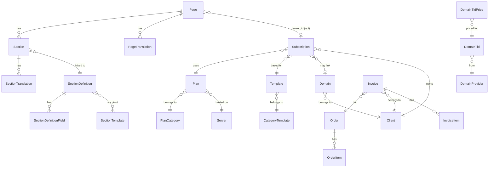

# Database Architecture

> **Last Updated:** 2026-06-15 · **Status:** Verified against migrations and models  
> **Priority:** Migrations > Models > Modern docs > Old docs

---

## Purpose

This document is the single authoritative reference for the Palgoals database schema.  
A new developer should be able to understand every table, its purpose, ownership, and relationships from this document alone.

For rendering behavior, see [09-rendering-flow.md](./09-rendering-flow.md).  
For section definition field semantics, see [07-section-definitions.md](./07-section-definitions.md).

---

## Database Design Principles

**1. Separation of Content vs. Definition**  
`sections` hold per-page content; `section_definitions` hold the blueprint of what that content looks like. The same definition serves many section instances across many pages.

**2. Translation Tables Pattern**  
Every user-visible text lives in a `*_translations` sibling table, never in the parent row. Each translation row is (`parent_id`, `locale`) with a unique constraint. The platform locale is selected at runtime — no URL prefixes.

**3. Soft Delete Usage**  
Soft deletes are applied selectively only where data recovery or audit integrity matters (billing, subscriptions, content headers, testimonials, portfolios). Core structural tables (pages, sections, definitions) do NOT use soft deletes.

**4. Tenant Isolation**  
Tenant data is not in a separate database or schema. Isolation is achieved by: `pages.context = 'tenant'`, `pages.tenant_id`, `sections.tenant_id`, and `subscriptions.subdomain` / `subscriptions.domain_name`. The `ServeTenantSite` middleware enforces runtime separation.

**5. Definition-Driven Architecture**  
A `Section` row is just a pointer: it has a `type` string and an optional `section_definition_id` FK. The definition drives what fields exist and how the section renders. See `07-section-definitions.md`.

**6. Cents for Money**  
All monetary amounts are stored as integer cents (`price_cents`, `monthly_price_cents`, `total_cents`). The `invoices` and `order_items` tables follow this pattern without exception. The `subscriptions.price` column uses `decimal(10,2)` — a historical inconsistency.

---

## Domain Overview

| Domain | Tables | Owner |
|--------|--------|-------|
| Content | `pages`, `page_translations`, `sections`, `section_translations` | Admin / Tenant |
| Definition | `section_definitions`, `section_definition_fields`, `section_templates`, `section_definition_template` | Admin only |
| Media | `media` | Admin / System |
| Tenancy | `clients`, `subscriptions`, `domains`, `domain_providers`, `domain_tlds`, `domain_tld_prices`, `servers`, `coupon_subscription`, `tenant_runtime_metrics` | System / Admin |
| Billing | `orders`, `order_items`, `invoices`, `invoice_items`, `coupons` | System / Admin |
| Catalog | `plans`, `plan_translations`, `plan_categories`, `plan_category_translations`, `templates`, `template_translations`, `category_templates`, `category_template_translations`, `template_reviews`, `portfolios`, `portfolio_translations`, `testimonials`, `testimonial_translations`, `services`, `service_translations` | Admin |
| Translation | `translation_values`, `languages` | Admin |
| System | `users`, `activity_logs`, `notifications`, `general_settings` | Admin / System |
| Headers | `headers`, `header_items`, `header_item_translations` | Admin |

---

## ER Diagram



---

## Content Domain

### `pages`

**Purpose:** Top-level content container. Can be a marketing page or a tenant page.

| Column | Type | Notes |
|--------|------|-------|
| `id` | bigint PK | |
| `context` | string | `marketing` or `tenant` · added 2025_11_30 |
| `subscription_id` | FK nullable | Legacy linkage to subscription · added 2025_11_30 |
| `tenant_id` | bigint nullable | Tenant ownership · added 2026_03_26 |
| `builder_mode` | string | `sections` (active) or `visual` (archived) · added 2026_03_15 |
| `is_active` | boolean | Default true |
| `is_home` | boolean | Only one marketing page should be `true` |
| `published_at` | timestamp nullable | Added 2025_09_26 |
| `created_at`, `updated_at` | timestamps | |

**Indexes:** `pages_context_subscription_index` (context + subscription_id), `pages_tenant_id_index`

**Relationships:** hasMany `PageTranslation`, hasMany `Section`, belongsTo `Subscription` (nullable)

**No soft deletes.**

---

### `page_translations`

**Purpose:** Per-locale content for a page, including slug, title, body content, and SEO fields.

| Column | Type | Notes |
|--------|------|-------|
| `id` | bigint PK | |
| `page_id` | FK → pages | CASCADE DELETE |
| `locale` | string | `ar`, `en`, etc. |
| `slug` | string nullable | Per-locale URL segment |
| `title` | string | |
| `content` | text nullable | WYSIWYG body (only used when `builder_mode = visual`) |
| `meta_title` | string nullable | |
| `meta_description` | text nullable | |
| `meta_keywords` | JSON nullable | |
| `og_image` | string nullable | Media ID (numeric) or URL path |

**Unique:** (`page_id`, `locale`), (`slug`, `locale`)  
**Index:** (`locale`, `slug`) — for slug-based routing

---

### `sections`

**Purpose:** Ordered content block inside a page. Each row is one section instance.

| Column | Type | Notes |
|--------|------|-------|
| `id` | bigint PK | |
| `page_id` | FK → pages | CASCADE DELETE |
| `section_definition_id` | FK nullable → section_definitions | `nullOnDelete` · added 2026_04_11 |
| `tenant_id` | bigint nullable | Tenant ownership · added 2026_03_26 |
| `type` | string | Section type key (e.g. `hero`, `services_grid`) · renamed from `key` 2025_11_30 |
| `variant` | string nullable | Design variant (e.g. `minimal`, `v2`) |
| `style` | string nullable | Added 2025_12_06 |
| `order` | integer | Display order within page |
| `is_active` | boolean | Toggle visibility without deletion |

**Indexes:** `sections_definition_type_idx` (section_definition_id + type), `sections_tenant_id_index`

**No soft deletes.**

---

### `section_translations`

**Purpose:** Per-locale content for a section. The `content` JSON column holds all field values.

| Column | Type | Notes |
|--------|------|-------|
| `id` | bigint PK | |
| `section_id` | FK → sections | CASCADE DELETE |
| `tenant_id` | bigint nullable | Added 2026_03_26 |
| `locale` | string | |
| `title` | string nullable | Optional human label |
| `content` | JSON nullable | All field values keyed by field_key |

**Unique:** (`section_id`, `locale`) — enforced by migration 2025_11_30_234343

> **Important:** The `content` JSON is the primary content store for definition-driven sections. The runtime resolves `$data['field_key']` from this column. See `07-section-definitions.md §7`.

---

## Definition Domain

> For full field semantics and render flow, see [07-section-definitions.md](./07-section-definitions.md). This section documents only the database schema.

### `section_definitions`

**Purpose:** Blueprint for a reusable section type. Describes what fields exist, the editor mode, and optionally stores the Blade source.

| Column | Type | Notes |
|--------|------|-------|
| `id` | bigint PK | |
| `section_key` | string unique | Stable developer identifier (e.g. `services_grid`) |
| `label` | string | Admin-facing display name |
| `description` | text nullable | Internal notes |
| `category` | string nullable | Grouping (e.g. `hero`, `features`) |
| `editor_mode` | string | Always `dynamic` · `custom_preset` normalized away by migration 2026_04_27 |
| `custom_editor_key` | string nullable | **Deprecated.** Legacy metadata, kept nullable for compatibility |
| `settings` | JSON nullable | Editor/runtime metadata |
| `schema` | JSON nullable | Future tooling schema |
| `is_active` | boolean | Inactive definitions are not offered in admin UI |
| `is_visible` | boolean | Visibility in library/selection UIs |
| `sort_order` | unsigned int | Admin display order |
| `blade_source` | LONGTEXT nullable | Source written via Monaco editor · added 2026_06_13 |
| `blade_written_at` | timestamp nullable | Last write timestamp · added 2026_06_13 |

**Indexes:** `custom_editor_key`, `section_definitions_category_order_idx` (category + sort_order), `section_definitions_visibility_idx` (is_active + is_visible + sort_order)

**No soft deletes.**

---

### `section_definition_fields`

**Purpose:** Field definitions belonging to a section definition. Describes what inputs exist and their type/scope.

| Column | Type | Notes |
|--------|------|-------|
| `id` | bigint PK | |
| `section_definition_id` | FK → section_definitions | CASCADE DELETE |
| `field_key` | string | Stable identifier within the definition |
| `label` | string | Admin-facing label |
| `help_text` | text nullable | |
| `field_type` | string | `text`, `textarea`, `richtext`, `url`, `media`, `number`, `boolean`, `select`, `repeater` |
| `field_scope` | string | `translatable` (per locale) or `shared` (one value for all locales) |
| `default_value` | JSON nullable | |
| `options` | JSON nullable | For select-type fields |
| `settings` | JSON nullable | Editor behavior flags |
| `schema` | JSON nullable | Future tooling |
| `is_required` | boolean | Admin UI validation contract |
| `is_active` | boolean | |
| `sort_order` | unsigned int | |

**Unique:** (`section_definition_id`, `field_key`)  
**Indexes:** `section_definition_fields_order_idx`, `section_definition_fields_visibility_idx`, `field_scope`, `field_type`

---

### `section_templates`

**Purpose:** Registry of available Blade templates. A definition links to one or more templates via the pivot.

| Column | Type | Notes |
|--------|------|-------|
| `id` | bigint PK | |
| `template_key` | string unique | Stable key used by runtime resolution (e.g. `portfolio_slider`) |
| `label` | string | Admin label |
| `description` | text nullable | |
| `category` | string nullable | Grouping |
| `settings` | JSON nullable | Metadata only, no Blade/PHP logic |
| `schema` | JSON nullable | |
| `is_active` | boolean | |
| `is_visible` | boolean | |
| `sort_order` | unsigned int | |

---

### `section_definition_template` (pivot)

**Purpose:** Many-to-many link between a definition and its allowed templates.

| Column | Type | Notes |
|--------|------|-------|
| `section_definition_id` | FK | CASCADE DELETE |
| `section_template_id` | FK | CASCADE DELETE |
| `sort_order` | unsigned int | Template ordering per definition |

**Unique:** (`section_definition_id`, `section_template_id`)

---

## Media Domain

### `media`

**Purpose:** Central file registry. Every uploaded file gets one row. Content records reference media by ID or path.

| Column | Type | Notes |
|--------|------|-------|
| `id` | bigint PK | |
| `file_name` | string | Hashed internal filename |
| `file_original_name` | string nullable | Original upload filename |
| `file_path` | string | Relative storage path (e.g. `media/2025/06/file.jpg`) |
| `file_extension` | string(20) nullable | |
| `mime_type` | string nullable | |
| `size` | unsigned bigint | Bytes |
| `file_type` | string(50) nullable | `image`, `video`, `audio`, `document`, `other` |
| `disk` | string(50) | Default `public`. Configurable via `FILESYSTEM_DISK` |
| `width` | unsigned int nullable | Images only |
| `height` | unsigned int nullable | Images only |
| `uploader_id` | unsigned bigint nullable | Admin user ID (no FK constraint) |
| `alt` | string nullable | |
| `title` | string nullable | |
| `caption` | text nullable | |
| `description` | text nullable | |

**URL Generation:** The `Media` model appends a computed `url` attribute via `Storage::url($this->file_path)`. Consumers call `$media->url`.

**No soft deletes.**

**References from other tables:**
- `testimonials.image_id` → `media.id`
- `section_definitions.preview_media_id` → `media.id` (added 2026_04_18)
- `page_translations.og_image` → stores Media ID (numeric) or URL string
- Any section field of type `media` → stores Media ID in `section_translations.content`

---

## Tenancy Domain

### `clients`

**Purpose:** End-user accounts (subscribers). Separate from `users` (admins). Uses `client` auth guard.

| Column | Type | Notes |
|--------|------|-------|
| `id` | bigint PK | |
| `first_name` | string | |
| `last_name` | string | |
| `email` | string unique | |
| `password` | string | |
| `company_name` | string | |
| `phone` | string nullable | Added 2025_07_30 |
| `can_login` | boolean | Default true. If false, portal login is blocked |
| `avatar` | string nullable | Media path (stored as string, not FK) |
| `status` | string | Active / Inactive · added 2025_08_19 |
| `address`, `city`, `country`, `zip_code` | strings nullable | Added 2025_08_19 |
| `rememberToken` | string nullable | |

**No soft deletes.**

**Relationships:** hasMany `Subscription`, hasMany `Domain`, hasMany `Order`, hasMany `Invoice`, hasMany `ActivityLog`

---

### `subscriptions`

**Purpose:** Core tenancy record. One row = one client website. Bridges client, plan, template, domain, and hosting provisioning.

| Column | Type | Notes |
|--------|------|-------|
| `id` | bigint PK | |
| `client_id` | FK → clients | CASCADE DELETE |
| `plan_id` | FK → plans | RESTRICT DELETE |
| `template_id` | FK nullable → templates | nullOnDelete |
| `status` | enum | `pending`, `active`, `suspended`, `cancelled` |
| `provisioning_status` | string | `pending`, `provisioning`, `active`, `failed` |
| `provisioned_at` | timestamp nullable | |
| `billing_cycle` | enum | `monthly`, `annually` |
| `price` | decimal(10,2) | Price at time of subscription (inconsistency: should be cents) |
| `engine` | string | `laravel` / `wordpress` / other |
| `username` | string nullable | Service username |
| `cpanel_username` | string nullable | WHM hosting only |
| `cpanel_password` | string nullable | WHM hosting only |
| `cpanel_url` | string nullable | WHM hosting only |
| `server_id` | unsigned bigint nullable | FK to servers (no constraint) |
| `server_package` | string nullable | WHM package name |
| `next_due_date` | date nullable | |
| `last_synced_at` | timestamp nullable | Last WHM sync |
| `last_sync_message` | string nullable | Last sync result/error |
| `starts_at` | date nullable | |
| `ends_at` | date nullable | |
| `domain_option` | enum | `new`, `subdomain`, `existing` |
| `domain_name` | string nullable | Full domain or subdomain FQDN |
| `subdomain` | string(191) nullable unique | Platform subdomain slug |
| `domain_id` | FK nullable → domains | nullOnDelete |
| `domain_verification_status` | string nullable indexed | `pending`, `dns_pending`, `ssl_pending`, `active`, `failed` |
| `domain_last_checked_at` | timestamp nullable | |
| `domain_verified_at` | timestamp nullable | |
| `domain_verification_error` | text nullable | |
| `settings` | JSON nullable | Misc runtime settings |
| `theme_settings` | JSON nullable | Per-subscription CSS theme overrides |
| `deleted_at` | timestamp nullable | **SoftDeletes** added 2026_05_05 |

**Plan types that affect behavior:**

| `plans.plan_type` | Provisioning path | Page serving |
|-------------------|-------------------|--------------|
| `multi_tenant` | `TemplateCloner` clones pages into `pages` (context=tenant) | `ServeTenantSite` renders via Section engine |
| `hosting` | `ProvisioningService` creates WHM/cPanel account | External hosting, not rendered by platform |

---

### `domains`

**Purpose:** Registered domain records owned by clients.

| Column | Type | Notes |
|--------|------|-------|
| `id` | bigint PK | |
| `client_id` | FK → clients | CASCADE DELETE |
| `domain_name` | string unique | |
| `registrar` | string | `enom`, `namecheap`, etc. |
| `registration_date` | date | |
| `renewal_date` | date nullable | |
| `status` | string | `active`, `expired`, `pending`, etc. |
| `payment_method` | string nullable | Added 2025_08_17 |
| `dns columns` | various | Added 2025_10_18 |
| `auto_renew` | boolean | Added 2026_03_10 |

> **Note:** `template_id` was added 2025_08_17 and **dropped** by migration 2025_09_16. There is no FK from domains to templates.

**No soft deletes.**

---

### `domain_providers`

**Purpose:** Registrar configuration records (Enom, Namecheap, Cloudflare, etc.).

| Column | Type | Notes |
|--------|------|-------|
| `id` | bigint PK | |
| `name` | string(191) | |
| `type` | string(50) indexed | `enom`, `namecheap`, `cloudflare`, etc. |
| `endpoint` | string nullable | API base URL |
| `username` | string nullable | |
| `password` | text nullable | |
| `api_token` | text nullable | |
| `api_key` | text nullable | |
| `client_ip` | string(45) nullable | For Namecheap IP whitelisting |
| `is_active` | boolean indexed | |
| `mode` | string(10) indexed | `live` or `test` |

---

### `domain_tlds`

**Purpose:** Supported TLD list per provider.

| Column | Type | Notes |
|--------|------|-------|
| `provider_id` | FK → domain_providers | CASCADE DELETE |
| `provider` | string(50) indexed | Denormalized provider name |
| `tld` | string(63) indexed | `.com`, `.net`, etc. |
| `currency` | char(3) | Default `USD` |
| `enabled` | boolean | |
| `supports_premium` | boolean | |
| `synced_at` | timestamp nullable | Last sync from registrar API |

**Unique:** (`provider_id`, `tld`)

---

### `domain_tld_prices`

**Purpose:** Per-action pricing for each TLD.

| Column | Type | Notes |
|--------|------|-------|
| `domain_tld_id` | FK → domain_tlds | CASCADE DELETE |
| `action` | enum | `register`, `renew`, `transfer`, `restore` |
| `years` | tinyint unsigned | Registration period |
| `cost` | decimal(10,2) nullable | Our cost from registrar |
| `sale` | decimal(10,2) nullable | Our selling price |

**Unique:** (`domain_tld_id`, `action`, `years`)

---

### `servers`

**Purpose:** WHM/cPanel server connection credentials used by the provisioning service.

| Column | Type | Notes |
|--------|------|-------|
| `id` | bigint PK | |
| `name` | string | Display name |
| `type` | string | Default `cpanel` |
| `ip` | string nullable | |
| `hostname` | string nullable | |
| `username` | string nullable | WHM login |
| `password` | text nullable | |
| `api_token` | text nullable | WHM API token |
| `is_active` | boolean | |

**No soft deletes.**

---

### `tenant_runtime_metrics`

**Purpose:** Lightweight aggregated hit counters for tenant page requests. Used for usage analytics.

| Column | Type | Notes |
|--------|------|-------|
| `subscription_id` | FK → subscriptions | CASCADE DELETE |
| `tenant_id` | unsigned bigint indexed | |
| `source` | string(32) indexed | |
| `page_model` | string(64) | |
| `page_id` | unsigned bigint nullable | |
| `path` | string(191) | Default `/` |
| `resolved_slug` | string(191) nullable | |
| `locale` | string(12) nullable | |
| `bucket_key` | string(64) unique | Aggregation key |
| `hits` | unsigned bigint | Counter |
| `first_seen_at` | timestamp nullable | |
| `last_seen_at` | timestamp nullable | |

---

### `coupon_subscription` (pivot)

**Purpose:** Many-to-many between coupons and subscriptions.

| Column | Notes |
|--------|-------|
| `coupon_id` | FK → coupons · CASCADE DELETE |
| `subscription_id` | FK → subscriptions · CASCADE DELETE |

---

## Billing Domain

### `orders`

**Purpose:** Purchase intent record. Created when a client initiates a purchase. Can trigger subscription activation via `OrderActivationService`.

| Column | Type | Notes |
|--------|------|-------|
| `id` | bigint PK | |
| `client_id` | FK nullable → clients | `nullOnDelete` — preserved for audit |
| `order_number` | string unique | |
| `status` | enum | `pending`, `active`, `cancelled`, `fraud` |
| `type` | string nullable | `domain`, `hosting`, `template`, etc. |
| `notes` | text nullable | |
| `deleted_at` | timestamp nullable | **SoftDeletes** added 2026_05_04 |

**Indexes:** (`client_id`, `status`), `type`

---

### `order_items`

**Purpose:** Line items within an order. Primarily domain operations.

| Column | Type | Notes |
|--------|------|-------|
| `order_id` | FK → orders | CASCADE DELETE |
| `domain` | string(191) nullable | e.g. `example.com` |
| `item_option` | string nullable | `register`, `transfer`, `subdomain`, `existing` |
| `price_cents` | unsigned bigint | In cents |
| `meta` | JSON nullable | Extra metadata |
| `deleted_at` | timestamp nullable | **SoftDeletes** added 2026_05_04 |

**Unique:** (`order_id`, `domain`) — allows multiple NULL domains per order

---

### `invoices`

**Purpose:** Financial invoice issued to a client. May be linked to an order.

| Column | Type | Notes |
|--------|------|-------|
| `id` | bigint PK | |
| `client_id` | FK → clients | CASCADE DELETE |
| `order_id` | FK nullable → orders | nullOnDelete |
| `number` | string unique | Invoice reference number |
| `status` | enum | `draft`, `unpaid`, `paid`, `cancelled` |
| `subtotal_cents` | integer | |
| `discount_cents` | integer | |
| `tax_cents` | integer | |
| `total_cents` | integer | |
| `currency` | string(3) | Default `USD` |
| `due_date` | date nullable | |
| `paid_date` | date nullable | |
| `deleted_at` | timestamp nullable | **SoftDeletes** added 2026_05_04 |

---

### `invoice_items`

**Purpose:** Line items within an invoice.

| Column | Type | Notes |
|--------|------|-------|
| `invoice_id` | FK → invoices | CASCADE DELETE |
| `item_type` | string | `product`, `domain`, `subscription` |
| `reference_id` | unsigned bigint nullable | ID of the referenced entity |
| `description` | string | |
| `qty` | unsigned int | Default 1 |
| `unit_price_cents` | integer | |
| `total_cents` | integer | |
| `deleted_at` | timestamp nullable | **SoftDeletes** added 2026_05_04 |

---

### `coupons`

**Purpose:** Discount codes applied to subscriptions via the `coupon_subscription` pivot.

| Column | Type | Notes |
|--------|------|-------|
| `code` | string unique | |
| `discount_type` | enum | `fixed` or `percent` |
| `discount_value` | decimal(10,2) | Amount or percentage |
| `expires_at` | date nullable | |

**No soft deletes.**

---

## Catalog Domain

### `plan_categories` + `plan_category_translations`

**Purpose:** Grouping for hosting plans.

`plan_categories`: `is_active`, `position`. **SoftDeletes** (from original migration).

`plan_category_translations`: `plan_category_id`, `locale`, `title`, `slug`, `description`  
**Unique:** (`plan_category_id`, `locale`), (`locale`, `slug`)

---

### `plans` + `plan_translations`

**Purpose:** Available hosting/site plans.

`plans` key columns:

| Column | Notes |
|--------|-------|
| `slug` | unique |
| `plan_type` | `multi_tenant` or `hosting` · added 2025_11_17 |
| `monthly_price_cents` | unsigned int |
| `annual_price_cents` | unsigned int |
| `is_active` | boolean |
| `is_featured` | boolean · added 2025_09_24 |
| `featured_label` | string nullable · added 2025_09_24 |
| `plan_category_id` | FK nullable → plan_categories |
| `server_id` | FK nullable → servers |
| `server_package` | string nullable · WHM package name |

`plan_translations`: `plan_id`, `locale`, `title`, `description`, `features` (JSON array of `{text, available}` objects)

---

### `category_templates` + `category_template_translations`

**Purpose:** Categories for the Template catalog (website design templates). **Distinct from `plan_categories`.**

`category_template_translations`: (`category_template_id`, `locale`) unique.

---

### `templates` + `template_translations`

**Purpose:** Website design templates used as blueprints for client sites.

`templates` key columns:

| Column | Notes |
|--------|-------|
| `category_template_id` | FK → category_templates |
| `price` | decimal(10,2) |
| `discount_price` | decimal(10,2) nullable |
| `discount_ends_at` | timestamp nullable |
| `image` | string |
| `rating` | float |
| `plan_id` | FK nullable → plans · added 2025_08_23 |

`template_translations`: per-locale name, description, slug, etc.

---

### `template_reviews`

**Purpose:** Client reviews/ratings for templates.  
**SoftDeletes** added 2026_05_15.

---

### `portfolios` + `portfolio_translations`

**Purpose:** Agency portfolio showcase items.

`portfolios`: `default_image`, `images` (JSON), `delivery_date`, `order`, `implementation_period_days`, `slug` (unique nullable), `client` (free text string — not FK).  
**SoftDeletes** added 2026_05_05.

---

### `testimonials` + `testimonial_translations`

> **ADR-006 implemented 2026-06-16.** Tables renamed from `feedbacks` / `feedback_translations`. Models now match table names — no `$table` override needed.

`testimonials`: `image_id` (FK → media, nullOnDelete), `star`, `order`, `is_approved`.  
`testimonial_translations`: `testimonial_id` (FK → testimonials.id, CASCADE), `locale`, `text`, `name`, `major`.  
**SoftDeletes** added 2026_05_05.

---

### `services` + `service_translations`

**Purpose:** Service items displayed on the marketing site.

`services`: `icon`, `order`, `url`.  
`service_translations`: per-locale title, description, etc.  
**No soft deletes.**

---

## Translation Architecture

The platform uses **two parallel translation mechanisms**:

### 1. `translation_values` — UI string translations

| Column | Notes |
|--------|-------|
| `key` | string(191), e.g. `dashboard.Add_Page` |
| `locale` | string(10), e.g. `ar` |
| `value` | text |

**Unique:** (`key`, `locale`)

Used by the `t()` helper function (`app/helpers.php`) for all admin and client portal UI strings. Managed via `DashboardTranslationsSeeder` and `SiteTranslationsSeeder`. Never used for content data.

### 2. `*_translations` sibling tables — content translations

Each translatable content model has its own translation table:

| Model | Table | Translation table |
|-------|-------|-------------------|
| Page | `pages` | `page_translations` |
| Section | `sections` | `section_translations` |
| Plan | `plans` | `plan_translations` |
| PlanCategory | `plan_categories` | `plan_category_translations` |
| Template | `templates` | `template_translations` |
| CategoryTemplate | `category_templates` | `category_template_translations` |
| Portfolio | `portfolios` | `portfolio_translations` |
| Testimonial | `testimonials` | `testimonial_translations` |
| Service | `services` | `service_translations` |
| Header Item | `header_items` | `header_item_translations` |

**Pattern:** Every sibling table has (`parent_id`, `locale`) with a unique constraint. The parent model has a `translations()` hasMany and a `translation(?locale)` helper that returns the current-locale row.

**When to use which:**
- `translation_values` → any fixed UI text (button labels, error messages, flash messages)
- `*_translations` → authored content that a human writes per-locale (page titles, template descriptions, etc.)

---

## Ownership Rules

| Table | Owner | Mutatable by |
|-------|-------|-------------|
| `pages` (context=marketing) | Platform admin | Admin dashboard |
| `pages` (context=tenant) | Tenant (client) | Client Portal editor after provisioning |
| `sections` (tenant) | Tenant | Client Portal section editor |
| `section_definitions` | Platform admin | Admin dashboard + Monaco editor |
| `section_definition_fields` | Platform admin | Admin dashboard |
| `media` | Platform admin | Admin media library; clients via picker |
| `clients` | System | Admin dashboard (CRUD) |
| `subscriptions` | System | Admin dashboard; auto-provisioned |
| `domains` | Client | Admin creates; auto-verified |
| `orders` | System | Auto-created on checkout |
| `invoices` | System | Admin can void/edit |
| `plans` | Platform admin | Admin dashboard |
| `templates` | Platform admin | Admin dashboard |
| `translation_values` | Platform admin | `/admin/translations` |
| `servers` | Platform admin | Admin dashboard |

---

## Soft Delete Strategy

### Tables WITH soft deletes (`deleted_at` column)

| Table | Added | Reason |
|-------|-------|--------|
| `subscriptions` | 2026_05_05 | Audit trail; recovery of accidentally cancelled sites |
| `invoices` | 2026_05_04 | Financial record retention |
| `invoice_items` | 2026_05_04 | Financial record retention |
| `orders` | 2026_05_04 | Audit / fraud investigation |
| `order_items` | 2026_05_04 | Audit trail |
| `plan_categories` | 2025_05_03 | Recovery of deleted categories |
| `portfolios` | 2026_05_05 | Content recovery |
| `testimonials` | 2026_05_05 | Content recovery |
| `template_reviews` | 2026_05_15 | Moderation / recovery |
| `headers` | 2026_05_08 | UI configuration recovery |
| `header_items` | 2026_05_08 | UI configuration recovery |

### Tables WITHOUT soft deletes

`pages`, `page_translations`, `sections`, `section_translations`, `section_definitions`, `section_definition_fields`, `section_templates`, `plans`, `plan_translations`, `templates`, `template_translations`, `clients`, `domains`, `domain_providers`, `domain_tlds`, `media`, `translation_values`, `languages`, `servers`, `activity_logs`, `coupons`, `services`

**Rationale for no soft deletes on structural tables:** Pages, sections, and definitions are versioned through content editing, not deletion. Hard delete is intentional — orphan sections cause render failures.

---

## Indexing Strategy

Key indexes found in migrations:

| Table | Index | Columns | Purpose |
|-------|-------|---------|---------|
| `page_translations` | unique | (`page_id`, `locale`) | One translation per locale |
| `page_translations` | unique | (`slug`, `locale`) | Unique slugs per locale |
| `page_translations` | index | (`locale`, `slug`) | Slug-based routing |
| `pages` | composite | (`context`, `subscription_id`) | Context-filtered page queries |
| `pages` | index | `tenant_id` | Tenant page lookup |
| `sections` | composite | (`section_definition_id`, `type`) | Definition-type correlation |
| `section_definitions` | composite | (`is_active`, `is_visible`, `sort_order`) | Admin list filtering |
| `section_definition_fields` | unique | (`section_definition_id`, `field_key`) | Stable field identity |
| `section_definition_fields` | index | `field_scope`, `field_type` | Field type queries |
| `translation_values` | unique | (`key`, `locale`) | One translation per key+locale |
| `languages` | unique | `code` | Added 2026_05_08 |
| `subscriptions` | index | `domain_verification_status` | Domain verification queries |
| `subscriptions` | unique | `subdomain` | One subdomain per subscription |
| `order_items` | unique | (`order_id`, `domain`) | One domain per order |
| `activity_logs` | index | (`actor_type`, `actor_id`), `action`, `created_at` | Activity queries |
| `tenant_runtime_metrics` | unique | `bucket_key` | Upsert-safe aggregation |
| `domain_tlds` | unique | (`provider_id`, `tld`) | One TLD per provider |
| `domain_tld_prices` | unique | (`domain_tld_id`, `action`, `years`) | One price per action/years |

---

## Common Relationships

```
Client
├── Subscription (hasMany)
│   ├── Plan (belongsTo)
│   ├── Template (belongsTo, nullable)
│   ├── Domain (belongsTo, nullable)
│   └── Page (canonical tenant pages via context=tenant)
├── Domain (hasMany)
├── Order (hasMany)
│   └── OrderItem (hasMany)
└── Invoice (hasMany)
    └── InvoiceItem (hasMany)

Page
└── Section (hasMany, ordered)
    ├── SectionTranslation (hasMany, per locale)
    └── SectionDefinition (belongsTo, nullable)
        ├── SectionDefinitionField (hasMany)
        └── SectionTemplate (belongsToMany via pivot)

Plan
├── PlanCategory (belongsTo, nullable)
├── Server (belongsTo, nullable)
└── Subscription (hasMany)

Template
├── CategoryTemplate (belongsTo)
├── TemplateTranslation (hasMany)
├── TemplateReview (hasMany)
└── Plan (belongsTo, nullable)
```

---

## Data Lifecycle

### New Tenant Site (multi_tenant plan)

```
Client subscribes to Plan (plan_type = multi_tenant)
↓
Subscription created (status=pending, provisioning_status=pending)
↓
TenantProvisioningService::provision() called
↓
TemplateCloner::cloneToTenant()
  → reads Template + its Sections
  → creates Page (context=tenant, tenant_id=subscription.id)
  → creates Sections (linked to same SectionDefinition records)
  → copies SectionTranslation content
↓
Subscription.provisioning_status → active
↓
ServeTenantSite serves the cloned pages when tenant host matches
```

### New Marketing Page

```
Admin creates Page (context=marketing, builder_mode=sections)
↓
Admin adds Sections, links each to a SectionDefinition
↓
Admin edits section content in the Section editor
  → SectionTranslation rows created/updated per locale
↓
Public request: PageController → page.blade.php
  → @foreach sections → definition-section.blade.php
  → SectionRenderer::renderDefinitionDriven()
  → SectionDefinitionFrontendViewDataFactory::build()
  → Blade view receives $data (from section_translations.content JSON)
```

### Domain Purchase

```
Client initiates domain purchase
↓
Order created (type=domain, status=pending)
  + OrderItem (domain, item_option=register, price_cents)
↓
Invoice created (linked to order)
↓
Payment → Invoice.status = paid
↓
OrderActivationService activates order
↓
RegistrarProvisioningService::register()
  → Creates Domain record
  → Calls Enom/Namecheap API
↓
Subscription.domain_id linked
↓
DomainVerificationService runs
  → Checks /.well-known/palgoals-domain-check
  → Updates Subscription.domain_verification_status
```

---

## Legacy Tables

| Table | Status | Notes |
|-------|--------|-------|
| `sites` | **Legacy** | Created 2025_08_18. Duplicated cpanel fields that were later absorbed into `subscriptions` (2025_11_17). The `Site` model exists but the table is no longer the source of truth. `Subscription` is. |
| `subscription_pages` | **Dropped** | Created 2025_11_17, dropped 2026_03_27. Superseded by canonical `pages` (context=tenant). |
| `subscription_page_translations` | **Dropped** | Same as above. |
| `subscription_sections` | **Dropped** | Same as above. |
| `subscription_section_translations` | **Dropped** | Same as above. |
| `page_builder_structures` | **Archived** | Created 2025_12_10 for GrapesJS visual builder. Pages with `builder_mode = visual` reference this. New pages always use `builder_mode = sections`. |
| `feedbacks` | **Renamed (ADR-006)** | Renamed to `testimonials` / `testimonial_translations` on 2026-06-16. `$table` overrides removed from models. No longer a technical debt item. |

---

## Migration Timeline

| Date | Migration | Impact |
|------|-----------|--------|
| 2025-05-03 | create_plans, create_plan_categories | Initial catalog |
| 2025-06-05 | create_translation_values | i18n system foundation |
| 2025-06-11 | create_media | Media library |
| 2025-06-26 | create_pages, create_sections, create_page/section_translations | Content domain foundation |
| 2025-07-28 | create_clients | Client auth |
| 2025-08-17 | create_subscriptions | Tenancy foundation |
| 2025-08-18 | create_sites, create_invoices (old) | Legacy provisioning (sites superseded) |
| 2025-08-22 | create_orders, create_servers | Billing + WHM integration |
| 2025-08-23 | rebuild_invoices_tables | Invoices rebuilt with cents |
| 2025-09-05 | create_domain_tlds, create_domain_tld_prices | Domain pricing catalog |
| 2025-09-12 | create_order_items | Order line items |
| 2025-11-17 | extend_subscriptions_for_tenants, add_plan_type_to_plans | Multi-tenant branching |
| 2025-11-17 | create_subscription_pages_tables | Tenant content (soon deprecated) |
| 2025-11-30 | update_pages_table_for_builder, update_sections_table_for_builder_v2 | Unified content model |
| 2025-12-10 | create_page_builder_structures | GrapesJS archive |
| 2026-03-26 | add_tenant_id_to_page_section_content_tables | Canonical tenant isolation |
| 2026-03-27 | drop_legacy_subscription_content_tables | Remove subscription_pages system |
| 2026-03-28 | add_domain_verification_to_subscriptions | Custom domain verification |
| 2026-04-11 | create_section_definitions + fields + templates | Definition engine launch |
| 2026-04-27 | normalize_section_definition_editor_mode_to_dynamic | Remove custom_preset mode |
| 2026-05-04 | add_soft_deletes_to_invoices/orders | Billing audit trail |
| 2026-05-05 | add_soft_deletes_to_subscriptions/portfolios/feedbacks | Content + tenancy recovery |
| 2026-06-16 | rename_feedbacks_to_testimonials (ADR-006) | Align DB table names with PHP model names |
| 2026-05-08 | add_soft_deletes_to_headers, add_unique_to_languages_code | UI + data integrity |
| 2026-06-13 | add_blade_source_to_section_definitions | Monaco Blade editor |

---

## Related Documents

| Document | Scope |
|----------|-------|
| [01-system-architecture.md](./01-system-architecture.md) | High-level architecture, domain boundaries |
| [07-section-definitions.md](./07-section-definitions.md) | Section Definition field types and render semantics |
| [09-rendering-flow.md](./09-rendering-flow.md) | How section_translations.content becomes HTML |
| [00-project-overview.md](./00-project-overview.md) | Project summary and conventions |

---

*Source of truth: migrations first, then models. When this document conflicts with the codebase, the codebase wins.*
