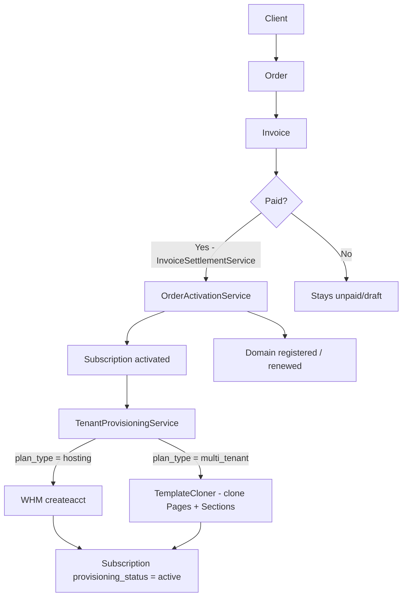

# Billing System

> **Last Updated:** 2026-06-15 · **Status:** Verified · **Source:** Code-first

---

## Purpose

This document is the authoritative reference for every money-related concept in Palgoals: orders, invoices, subscriptions, coupons, provisioning, and the full activation lifecycle. It supersedes `invoice-system.md`, `order-system.md`, and `subscription-system.md` (all archived to `docs/_archive/legacy-docs/`).

Do not use those files as reference. If there is a conflict, this document and the code win.

---

## Billing Principles

Three principles drive every design decision in this system:

**1. Order First** — An `Order` is the commercial intent. It is created before any invoice, before any payment, before any subscription exists. It holds what the client wants to buy and at what price.

**2. Invoice Second** — An `Invoice` is the financial record. It is linked to an `Order` and contains the `InvoiceItem` breakdown (subscriptions, domains, products). Invoices can exist without an Order (standalone domain invoices), but most do not.

**3. Subscription Activation Last** — A `Subscription` becomes `active` only after an Invoice is marked `paid`. Activation triggers provisioning (WHM account creation or template content cloning), not the other way around.

**No payment gateway exists yet.** All current payment flows use `mock_gateway`. Real card/transfer integration is a future step.

---

## Domain Overview



---

## Core Models

| Model | Namespace | Table | Responsibility |
|-------|-----------|-------|----------------|
| `Order` | `App\Models` | `orders` | Commercial intent — what was purchased |
| `OrderItem` | `App\Models` | `order_items` | Line item within an order (domain, hosting) |
| `Invoice` | `App\Models` | `invoices` | Financial document linked to an Order |
| `InvoiceItem` | `App\Models` | `invoice_items` | Line item within an invoice (subscription ref, domain ref) |
| `Subscription` | `App\Models\Tenancy` | `subscriptions` | Activated service; drives tenant site + WHM account |
| `Coupon` | `App\Models` | `coupons` | Discount codes — **model exists, not yet wired into billing** |
| `Plan` | `App\Models` | `plans` | Hosting plan template; drives pricing and WHM package |
| `Domain` | `App\Models` | `domains` | Registered domain record |

---

## Billing Lifecycle

Full lifecycle from purchase decision to live tenant site:

```
1.  Admin creates Order (status: pending)
2.  Admin creates Invoice (status: draft) linked to Order
3.  Admin adds InvoiceItems (subscription ref_id, domain name, etc.)
4.  Admin activates Order → OrderActivationService::activate()
         → draft invoices flipped to unpaid
5.  Client or Admin pays Invoice
         → InvoiceSettlementService::markPaid()          [DB transaction, row lock]
         → Invoice.status = paid, paid_date = now()
         → Order.status = active
         → OrderActivationService::activate()
              → Subscription.status = active
              → Subscription.starts_at / ends_at / next_due_date set
              → Domain registration/renewal (if item_option = register/renew)
              → TenantProvisioningService::provision()
                   → provisioning_status = in_progress
                   → ensureDomain() — assigns/creates subdomain or verifies custom domain
                   → if hosting plan: WHM createacct via SubscriptionSyncService
                   → if multi_tenant plan: TemplateCloner::cloneToTenant()
                   → provisioning_status = active (or failed)
                   → DomainVerificationService::reset() + verify()
                   → Notifications: SubscriptionProvisionedNotification (client)
                                    AdminSubscriptionProvisioned (all super_admins)
```

---

## Orders

### Schema (`orders` table)

| Column | Type | Notes |
|--------|------|-------|
| `id` | bigint PK | |
| `client_id` | FK → clients (nullable) | Set to NULL on client delete (preserves accounting records) |
| `order_number` | string unique | Auto-generated: `ORD-YYYYMMDD-XXXXXXXX`. **Immutable after creation.** |
| `status` | enum | `pending`, `active`, `cancelled`, `fraud` |
| `type` | string nullable | `domain`, `hosting`, `template`, or custom |
| `notes` | text nullable | Admin notes |
| `created_at` | timestamp | |
| `updated_at` | timestamp | |
| `deleted_at` | timestamp nullable | SoftDeletes |

### Status Machine

```
pending ──────────────► active ──────────────► cancelled
   │                                                ▲
   └────────────────────────────────────────────► fraud
```

| Transition | Trigger |
|------------|---------|
| `pending` → `active` | `InvoiceSettlementService::markPaid()` calls `OrderActivationService::activate()` which sets Order to `active` when the linked invoice is paid |
| `pending/active` → `cancelled` | Admin bulk action or manual update |
| `any` → `fraud` | Admin manual flagging |

### Relationships

```php
$order->client       // BelongsTo Client (withDefault — safe even if client deleted)
$order->items        // HasMany OrderItem
$order->invoices     // HasMany Invoice
```

### Key Behaviour

- `Order::createWithUniqueNumber()` must be used instead of `Order::create()` when auto-generating order numbers — it retries up to 5 times on `SQLSTATE 23000` collisions.
- `order_number` is locked after creation via `booted()` hook. Any attempt to update it is silently ignored.
- `$order->subtotalCents()` sums `price_cents` from `order_items`. Does not read Invoice.

---

## Order Items

### Schema (`order_items` table)

| Column | Type | Notes |
|--------|------|-------|
| `id` | bigint PK | |
| `order_id` | FK → orders (cascade) | |
| `domain` | string(191) nullable | FQDN: `example.com` |
| `item_option` | string nullable | `register`, `renew`, `transfer`, `subdomain`, `existing` |
| `price_cents` | bigint | **Integer cents.** Cast to `integer`. |
| `meta` | json nullable | Registration date, renewal date, years, etc. |
| `deleted_at` | timestamp nullable | SoftDeletes |

**Unique constraint:** `(order_id, domain)` — same domain cannot appear twice in one order. NULLs are exempt.

### Domain Options

| `item_option` | Meaning |
|--------------|---------|
| `register` | Register new domain via registrar (Namecheap/Enom) |
| `renew` | Renew existing domain via registrar |
| `subdomain` | Use a platform subdomain (tenant_fqdn) |
| `existing` | Client provides their own domain (no registrar action) |

---

## Invoices

### Schema (`invoices` table)

| Column | Type | Notes |
|--------|------|-------|
| `id` | bigint PK | |
| `client_id` | FK → clients (cascade) | |
| `order_id` | FK → orders (nullable, nullOnDelete) | NULL = standalone invoice (e.g. domain renewal) |
| `number` | string unique | Human-readable invoice number |
| `status` | enum | `draft`, `unpaid`, `paid`, `cancelled` |
| `subtotal_cents` | integer | Before discount and tax |
| `discount_cents` | integer | Applied discount (currently always 0 — see Technical Debt) |
| `tax_cents` | integer | Tax amount (currently always 0 — see Tax Handling) |
| `total_cents` | integer | `subtotal - discount + tax` |
| `currency` | string(3) | Default `USD` |
| `due_date` | date nullable | |
| `paid_date` | date nullable | Set automatically when status → `paid` |
| `deleted_at` | timestamp nullable | SoftDeletes |

### Status Machine

```
draft ──► unpaid ──► paid
  │                   │
  └──────────────► cancelled
```

| Transition | Who triggers it |
|------------|----------------|
| Created as `draft` | Admin creates invoice |
| `draft` → `unpaid` | `OrderActivationService::activate()` — called when Order is activated |
| `unpaid` → `paid` | `InvoiceSettlementService::markPaid()` — called after payment |
| Any → `cancelled` | Admin bulk action or manual update |

### `scopePaid()` and `scopeUnpaid()`

```php
Invoice::paid()->sum('total_cents')    // total revenue
Invoice::unpaid()->sum('total_cents')  // includes 'draft' and 'unpaid' status
```

### Settlement Contract

`InvoiceSettlementService::markPaid(Invoice $invoice, ?string $paymentMethod)`:

1. Opens a DB transaction
2. Acquires `lockForUpdate()` on the invoice row (prevents double-payment)
3. Guards against double-settlement: returns early if already `paid`
4. Sets `status = paid`, `paid_date = now()`
5. If invoice has an Order: activates the Order, calls `OrderActivationService::activate()`
6. If no Order (standalone): calls `syncStandaloneInvoiceDomain()` — finds domain item and sets `Domain.status = active`
7. If domain registration fails inside the transaction: throws `RuntimeException`, rolls everything back

### Creating Invoices

The `InvoiceController::calculateTotals()` method:

```php
$subtotal = sum of (qty × unit_price_cents) per InvoiceItem
$discount = 0   // coupons not yet wired in
$tax      = 0   // no tax calculation
$total    = max(0, $subtotal - $discount + $tax)
```

---

## Invoice Items

### Schema (`invoice_items` table)

| Column | Type | Notes |
|--------|------|-------|
| `id` | bigint PK | |
| `invoice_id` | FK → invoices (cascade) | |
| `item_type` | string | `subscription`, `domain`, or `product` |
| `reference_id` | bigint nullable | FK to `subscriptions.id` or `domains.id` depending on `item_type` |
| `description` | string | Human-readable line item description |
| `qty` | unsignedInt | Default 1 |
| `unit_price_cents` | integer | Per-unit price |
| `total_cents` | integer | `qty × unit_price_cents` |
| `deleted_at` | timestamp nullable | SoftDeletes |

### Type-Guarded Accessors

Do not access `subscriptionRelation` or `domainRelation` directly. Use the type-guarded accessors:

```php
$item->subscription   // returns Subscription|null — only when item_type = 'subscription'
$item->domain         // returns Domain|null — only when item_type = 'domain'
```

These guard against phantom FK matches when a subscription ID happens to equal a domain ID.

---

## Subscriptions

### Schema (`subscriptions` table — cumulative across all migrations)

| Column | Type | Notes |
|--------|------|-------|
| `id` | bigint PK | |
| `client_id` | FK → clients (cascade) | |
| `plan_id` | FK → plans (restrictOnDelete) | |
| `template_id` | bigint nullable | FK → templates |
| `status` | enum | `pending`, `active`, `suspended`, `cancelled` |
| `provisioning_status` | enum | `pending`, `provisioning`, `active`, `failed` |
| `provisioned_at` | datetime nullable | Set when provisioning_status → active |
| `price` | decimal(10,2) | **⚠️ TD-1 — should be integer cents** |
| `billing_cycle` | enum | `monthly`, `annually` |
| `engine` | string nullable | |
| `username` | string nullable | WHM/cPanel username |
| `cpanel_username` | string nullable | |
| `cpanel_password` | string nullable | ⚠️ Stored in plaintext — see Security |
| `cpanel_url` | string nullable | |
| `server_id` | bigint nullable | FK → servers |
| `server_package` | string nullable | WHM package name |
| `next_due_date` | date nullable | |
| `starts_at` | date nullable | Set on activation |
| `ends_at` | date nullable | Set on activation (starts_at + 1 month or 1 year) |
| `last_synced_at` | datetime nullable | |
| `last_sync_message` | text nullable | Last WHM response |
| `domain_option` | enum | `new`, `subdomain`, `existing` |
| `domain_name` | string nullable | FQDN |
| `subdomain` | string nullable | Platform subdomain (without FQDN) |
| `domain_id` | bigint nullable | FK → domains |
| `domain_verification_status` | string nullable | `pending`, `dns_pending`, `ssl_pending`, `active`, `failed` |
| `domain_last_checked_at` | datetime nullable | |
| `domain_verified_at` | datetime nullable | |
| `domain_verification_error` | text nullable | |
| `settings` | json nullable | |
| `theme_settings` | json nullable | |
| `deleted_at` | timestamp nullable | SoftDeletes |

### Status Machines

**`status` (business status):**

```
pending ──► active ──► suspended ──► active   (unsuspend)
                │
                └──────────────────► cancelled  (terminate)
```

| Transition | Trigger |
|------------|---------|
| `pending` → `active` | `OrderActivationService::activate()` on payment |
| `active` → `suspended` | Admin action → `suspendacct` WHM call |
| `suspended` → `active` | Admin action → `unsuspendacct` WHM call |
| `active/suspended` → `cancelled` | Admin terminate → `TerminateSubscriptionOnProvider` job → `removeacct` WHM call |

**`provisioning_status` (technical status):**

```
pending ──► provisioning ──► active
                  │
                  └──────────► failed
```

| Transition | Trigger |
|------------|---------|
| `pending` → `provisioning` | `TenantProvisioningService::provision()` start |
| `provisioning` → `active` | WHM createacct success OR TemplateCloner success |
| `provisioning` → `failed` | Exception thrown during WHM call or template cloning |

### Domain Helpers

```php
$sub->requiresDomainVerification()   // true if domain_option !== 'subdomain' and not a platform host
$sub->effectiveDomainVerificationStatus()   // accounts for non-custom domains (returns 'active' implicitly)
$sub->activeSiteHost()               // returns the live hostname for the tenant site
$sub->activeSiteUrl()                // full URL including scheme
$sub->fallbackSiteHost()             // platform subdomain as fallback when custom domain not verified
```

---

## Coupons

### Schema (`coupons` table)

| Column | Type | Notes |
|--------|------|-------|
| `id` | bigint PK | |
| `code` | string unique | Coupon code |
| `discount_type` | enum | `fixed`, `percent` |
| `discount_value` | decimal(10,2) | ⚠️ **TD-2** — should be integer cents for `fixed` type |
| `expires_at` | date nullable | |

### Pivot Table (`coupon_subscription`)

| Column | Notes |
|--------|-------|
| `coupon_id` | FK → coupons (cascade) |
| `subscription_id` | FK → subscriptions (cascade) |
| `created_at` / `updated_at` | |

### Current State

**The Coupon model and pivot table exist, but coupon application is not wired into the billing calculation.** The `InvoiceController::calculateTotals()` method hard-codes `$discount = 0`. The `Subscription::coupons()` relationship stores which coupons are associated, but this association does not affect Invoice `discount_cents`.

See **Technical Debt § TD-3**.

---

## Provisioning Flow

Two provisioning paths exist, determined by `Plan.plan_type`:

### Path A — `hosting` (WHM/cPanel)

Called by `TenantProvisioningService::provision()` when `$subscription->plan->plan_type === 'hosting'`.

```
SubscriptionSyncService::sync($subscription)
  1. Resolve server credentials (hostname/IP + WHM API token)
  2. Resolve server_package from subscription.server_package or plan.server_package
  3. Build createacct params: domain, plan, contactemail, password
  4. Generate username candidates (up to 5):
       candidate 1: subscription.username (if exists)
       candidate 2: client.slug + subscription.id
       candidate 3: palgoal{subscription.id}
       candidates 4-5: palgoal{subscription.id}{n}
  5. Sanitize username: lowercase, alphanumeric, max 16 chars
  6. POST to https://{host}:2087/json-api/createacct (WHM API)
  7. On success: update subscription.username if a different candidate was used
  8. On all failures: return error message → TenantProvisioningService sets provisioning_status = failed
```

**WHM Terminate:** `SubscriptionSyncService::terminate()` calls `removeacct` and sets `subscription.status = cancelled`.

**WHM Suspend/Unsuspend:** Direct calls from `SubscriptionController::suspendToProvider()` / `unsuspendToProvider()` — `suspendacct` / `unsuspendacct` WHM calls.

### Path B — `multi_tenant` (Template Cloning)

Called when `$subscription->plan->plan_type === 'multi_tenant'`.

```
TenantProvisioningService::provisionMultiTenant($subscription)
  1. TemplateCloner::cloneToTenant(template: $sub->template, tenant: $sub)
  2. Creates Page records (context = 'tenant', tenant_id = subscription.id)
  3. Clones all Sections + SectionTranslations from template pages
  4. Guard: if tenant content already exists → skip (idempotent)
```

### Queue Behaviour

- `ProvisionSubscription` job — dispatched on `provisioning` queue. Direct call path: `TenantProvisioningService` called synchronously from `OrderActivationService::activate()`. The job is also available for manual re-provisioning.
- `SyncSubscriptionToProvider` job — dispatched when the fallback path in `OrderActivationService` creates a new subscription. Uses 3 retries.
- `TerminateSubscriptionOnProvider` job — dispatched from admin bulk-terminate action. 3 retries.

---

## Activation Flow

What happens step-by-step after an invoice is paid:

```
InvoiceSettlementService::markPaid($invoice, $paymentMethod)
│
├── [DB transaction + row lock]
├── Invoice.status = paid, Invoice.paid_date = now()
├── Order.status = active
│
└── OrderActivationService::activate($order, $paymentMethod)
    │
    ├── Flip draft invoices → unpaid
    ├── Extract domain from first order_item with a domain value
    │
    ├── [If item_option = register or renew]
    │   └── RegistrarProvisioningService::provisionOrderDomain()
    │       ├── Finds active DomainProvider (Namecheap first, then Enom)
    │       ├── Calls registrar API (create or renew)
    │       ├── Updates Domain.status = active on success
    │       └── On failure → throws RuntimeException → ROLLS BACK entire transaction
    │
    ├── [Path A: invoice items have subscription reference_ids]
    │   ├── Load subscriptions from reference_ids
    │   ├── For each subscription:
    │   │   ├── status = active
    │   │   ├── starts_at = now()
    │   │   ├── ends_at = starts_at + 1 month (monthly) or 1 year (annually)
    │   │   ├── next_due_date = ends_at
    │   │   └── TenantProvisioningService::provision()
    │   └── Return collected activated subscriptions
    │
    └── [Path B: fallback — no subscription refs in items]
        ├── Find first invoice item with item_type = subscription
        ├── Treat reference_id as Template ID (⚠️ TD-4 — ambiguous)
        ├── Create OR update Subscription
        └── Dispatch SyncSubscriptionToProvider job
```

---

## Domain Purchase Flow

Handled inside `OrderActivationService::activate()` → `RegistrarProvisioningService::provisionOrderDomain()`.

### Supported Registrars

| Registrar | Client Class | Default Priority |
|-----------|-------------|-----------------|
| Namecheap | `App\Services\Domains\Clients\NamecheapClient` | 1 (preferred) |
| Enom | `App\Services\Domains\Clients\EnomClient` | 2 (fallback) |

Provider selected by `DomainProvider::active()->whereIn('type', ['namecheap', 'enom'])->orderByRaw(...)`.

### Registration Flow

```
1. Find order item where domain is set and item_option = 'register'
2. Normalize domain (lowercase, IDN → ASCII)
3. Find active DomainProvider (namecheap preferred)
4. Build WHOIS contact payload from Client fields (all 4 roles: Registrant, Admin, Tech, AuxBilling)
5. Call registrar API:
   - Namecheap: namecheap.domains.create
   - Enom: Purchase command
6. On success:
   - Domain.status = active
   - Domain.registrar = provider.type
   - Attach Domain to all invoice items with item_type = domain
7. On failure:
   - Domain.status = pending, dns_last_note = error
   - Return {ok: false, message: ...}
   - InvoiceSettlementService throws RuntimeException → FULL ROLLBACK
```

### Renewal Flow

```
1. Find order item where item_option = 'renew'
2. Resolve Domain record from client_id + domain_name
3. Find DomainProvider (preferring domain's current registrar)
4. Call renew API (Namecheap: namecheap.domains.renew, Enom: Extend command)
5. Update Domain.renewal_date on success
```

---

## Status Machines (Summary)

### Order

| Status | Meaning |
|--------|---------|
| `pending` | Created, awaiting payment / activation |
| `active` | Invoice paid, subscriptions activated |
| `cancelled` | Cancelled by admin |
| `fraud` | Flagged as fraudulent |

### Invoice

| Status | Meaning |
|--------|---------|
| `draft` | Created, not yet presented |
| `unpaid` | Presented to client, payment due |
| `paid` | Payment confirmed, activation triggered |
| `cancelled` | Voided |

### Subscription — business status

| Status | Meaning |
|--------|---------|
| `pending` | Created, awaiting activation |
| `active` | Paid and provisioned |
| `suspended` | Temporarily suspended (WHM: suspendacct) |
| `cancelled` | Terminated permanently (WHM: removeacct) |

### Subscription — provisioning_status

| Status | Meaning |
|--------|---------|
| `pending` | Not yet attempted |
| `provisioning` | In progress (WHM call or template clone running) |
| `active` | Successfully provisioned |
| `failed` | Provisioning threw an exception |

---

## Money Storage Rules

> **Rule: All monetary amounts are stored as integer cents.**

This is the project standard. `1000` = `$10.00`. Never use floats for money.

| Model | Column | Type | Compliant? |
|-------|--------|------|-----------|
| `Invoice` | `subtotal_cents`, `discount_cents`, `tax_cents`, `total_cents` | `integer` | ✅ |
| `InvoiceItem` | `unit_price_cents`, `total_cents` | `integer` | ✅ |
| `OrderItem` | `price_cents` | `unsignedBigInteger` | ✅ |
| `Plan` | `monthly_price_cents`, `annual_price_cents` | `integer` | ✅ |
| `Subscription` | `price` | `decimal(10,2)` cast to `float` | **❌ TD-1** |
| `Coupon` | `discount_value` | `decimal(10,2)` | **❌ TD-2** |

**Reading Plan prices:**

```php
$plan->monthly_price        // float: monthly_price_cents / 100
$plan->annual_price         // float: annual_price_cents / 100
$plan->formatted_monthly_price  // string: "$10.00"
$plan->formatted_annual_price   // string: "$100.00"
```

> **ADR-003 (pending):** The formal ADR for integer-cents-only storage across all models has not been written. When created, it should mandate migrating `subscriptions.price` → `price_cents` and `coupons.discount_value` → `discount_value_cents`.

---

## Pricing Rules

### Plan Pricing

Two price columns per plan, both in cents:

| Column | Billing Cycle |
|--------|--------------|
| `monthly_price_cents` | Monthly subscriptions |
| `annual_price_cents` | Annual subscriptions |

### Subscription Price at Creation

When a subscription is created via `OrderActivationService` fallback path (Path B), `$template->price` is used — a `decimal` field, not cents. This is another instance of TD-1.

### Discounts

Coupons exist but are not applied in the billing calculation. `discount_cents` is always `0` in generated invoices.

### Renewals

`ends_at` / `next_due_date` are set at activation time:

```php
$billingCycle = $subscription->billing_cycle ?? 'annually';
$nextDueDate  = str_contains($billingCycle, 'month')
    ? $startsAt->copy()->addMonth()
    : $startsAt->copy()->addYear();
```

No automatic renewal billing exists. Renewals must be created manually by an admin.

---

## Tax Handling

No tax system is implemented. The `tax_cents` column exists in the `invoices` table and is set to `0` in all invoice creation flows. No tax rate configuration exists in the codebase.

If tax is required in the future, the `tax_cents` column is already present — a rate calculation step must be added to `InvoiceController::calculateTotals()`.

---

## Payment Flow

### Current Reality — No Real Gateway

There is no payment gateway integration. All payment flows use the string `'mock_gateway'` as the payment method identifier.

### Entry Points

| Controller | Route context | Trigger |
|-----------|---------------|---------|
| `InvoiceCheckoutController::pay()` | Client portal | Client clicks "Pay" on their invoice |
| `CheckoutController` | Public front-end checkout | Public order completion |
| `InvoiceController::bulkAction()` | Admin dashboard | Admin marks invoice(s) as paid manually |

All three paths eventually call:

```php
app(InvoiceSettlementService::class)->markPaid($invoice, 'mock_gateway');
```

### Admin Manual Payment

Admin can set invoice status to `paid` directly via the edit form or bulk action. The bulk action path also calls `InvoiceSettlementService` to trigger full activation.

### Webhook / Online Gateway

Not implemented. The `Domain.payment_method` column stores `'mock_gateway'` as a placeholder.

---

## Failure Handling

### Invoice Settlement Failure

`InvoiceSettlementService::markPaid()` runs inside a `DB::transaction()`. Any exception (including domain registration failure) rolls back the entire transaction. The invoice remains in its previous state. Admin must retry.

### Provisioning Failure

`TenantProvisioningService::provision()` catches `Throwable`:

```php
$subscription->forceFill([
    'provisioning_status' => Subscription::PROVISIONING_FAILED,
    'last_sync_message'   => $exception->getMessage(),
])->save();
```

The `provisioning_status` is set to `failed` and the error message is stored in `last_sync_message`. The subscription remains `active` (billing was settled), only provisioning failed. Admin can retry via WHM sync action.

### WHM createacct Failure

`SubscriptionSyncService::sync()` tries up to 5 username candidates. On all failures, returns an error string (does not throw). `TenantProvisioningService` re-throws, which sets `provisioning_status = failed`.

### Domain Registration Failure

`RegistrarProvisioningService` returns `['ok' => false, 'message' => '...']`. `InvoiceSettlementService` receives this and throws `RuntimeException`, rolling back the full settlement transaction.

### Queue Job Failure

- `ProvisionSubscription` — throws on failure (retried by queue worker). `provisioning_status` is set to `failed` after the last attempt.
- `SyncSubscriptionToProvider` — 3 retries. Updates `last_sync_message` on failure.
- `TerminateSubscriptionOnProvider` — 3 retries. Logs failure. Subscription status is not changed if WHM call fails.

---

## Security Considerations

See `docs/24-security-notes.md` for the full security model. Billing-specific risks:

| Risk | Detail |
|------|--------|
| `cpanel_password` stored in plaintext | `subscriptions.cpanel_password` is a fillable string column with no encryption. If the database is compromised, all hosted account credentials are exposed. |
| WHM API token stored in DB | `servers.api_token` is stored as plaintext. Same exposure risk. |
| No idempotency key on payment | `lockForUpdate()` prevents double-settlement within a single process, but there is no external idempotency key for retried webhook calls (no real gateway yet). |
| Mock gateway in production | `'mock_gateway'` is hardcoded as the payment method. Any client who can reach the checkout route can pay without providing real payment credentials. |

---

## Common Workflows

### Create an Invoice Manually (Admin)

```
1. Go to /admin/invoices/create
2. Select client
3. Select order (optional — leave blank for standalone invoice)
4. Add InvoiceItems (subscription ref_id + description + qty + price)
5. Set status = draft (default) or unpaid
6. Save → totals are calculated server-side (subtotal - 0 + 0)
```

### Mark Invoice as Paid (Admin)

```
1. Open invoice or use bulk action
2. Set status = paid
3. InvoiceSettlementService::markPaid() is called
4. Order activated → Subscription activated → Provisioning dispatched
```

### Apply Coupon (Not Yet Possible)

Coupons cannot be applied to invoices. The `coupon_subscription` pivot exists but the billing calculator does not read from it. See TD-3.

### Activate Subscription Manually

```
1. Open subscription in admin
2. Use "Sync to Provider" action
3. SubscriptionSyncService::sync() is called directly
4. WHM createacct is attempted
5. provisioning_status updates to active or failed
```

### Terminate Subscription

```
1. Admin bulk-terminate action OR individual terminate button
2. TerminateSubscriptionOnProvider job dispatched (3 retries)
3. WHM removeacct called
4. Subscription.status = cancelled
```

### Suspend / Unsuspend

```
1. Admin action in SubscriptionController
2. Direct WHM calls: suspendacct / unsuspendacct
3. Subscription.status updated to suspended / active
```

---

## Technical Debt

| ID | Location | Issue | Priority |
|----|----------|-------|----------|
| TD-1 | `subscriptions.price decimal(10,2)` | Money stored as float, not integer cents. Violates the project money-storage rule. Must be migrated to `price_cents integer`. | High |
| TD-2 | `coupons.discount_value decimal(10,2)` | Same violation. `fixed` type discounts should be stored as `discount_value_cents integer`. | Medium |
| TD-3 | `InvoiceController::calculateTotals()` | `$discount = 0` — coupon application is not wired in. The coupon model, pivot table, and subscriptions relationship all exist but nothing reads them. | High |
| TD-4 | `OrderActivationService` Path B fallback | When no subscription `reference_id` is in invoice items, the code treats the first invoice item's `reference_id` as a `Template` ID and creates a new Subscription from it. This is confusing (same column, different entity) and error-prone. | Medium |
| TD-5 | All payment flows | `'mock_gateway'` is hardcoded everywhere. No real payment gateway exists. Any authenticated client can checkout without providing real payment. | Critical (pre-production) |
| TD-6 | `SubscriptionSyncService::sync()` | cPanel password for WHM account is generated via `Str::random(14) . '!A9'` if not set on subscription, but is never persisted back to the subscription record. Password is effectively lost after WHM account creation. | High |
| TD-7 | `OrderActivationService` Path B | `reference_id` is used for both Subscription IDs (Path A) and Template IDs (Path B). This dual-use of the same column in the same `item_type = 'subscription'` items makes the code ambiguous. Path B was likely temporary scaffolding. | Medium |

---

## Future Improvements

These are evident from the code structure (not speculative roadmap items):

**Payment Gateway** — The architecture is ready for a real gateway. `InvoiceSettlementService::markPaid($invoice, $paymentMethod)` accepts a payment method string. Adding a real gateway means calling `markPaid` with the real gateway identifier after webhook confirmation.

**Coupon Application** — The data model is complete. Only `InvoiceController::calculateTotals()` needs to be updated to read `Coupon.discount_value` and apply it to `discount_cents`.

**Automatic Renewals** — `next_due_date` is tracked per subscription. A scheduled job that queries `subscriptions.next_due_date <= today` and creates renewal invoices would complete the renewal lifecycle.

**ADR-003** — A formal decision record is needed for the integer-cents-only money storage rule, mandating the migration path for TD-1 and TD-2.

---

## Related Documents

| Document | What it covers |
|----------|---------------|
| [03-database-architecture.md](03-database-architecture.md) | Full schema, indexes, FK cascade rules |
| [24-security-notes.md](24-security-notes.md) | WHM credential risks, auth model, policy system |
| [01-system-architecture.md](01-system-architecture.md) | Service layer design, queue configuration |
| [adr/001-page-section-as-source-of-truth.md](adr/001-page-section-as-source-of-truth.md) | ADR-001: Page+Section as tenant content model |
