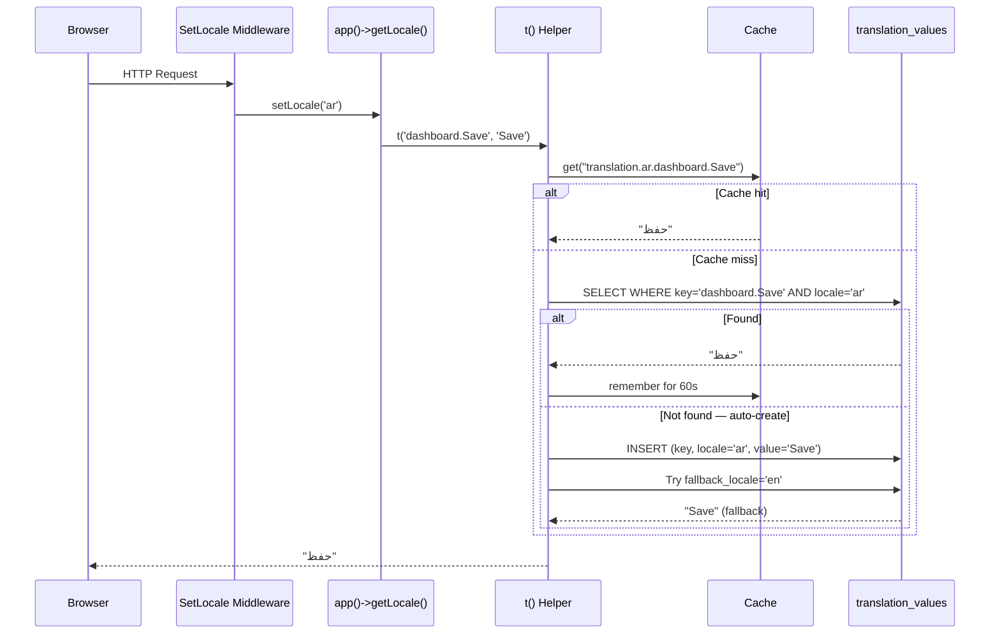

# Locale & Translation System

> **Last Updated:** 2026-06-15 · **Status:** Verified · **Source:** Code-first

---

## Purpose

This document is the authoritative reference for everything related to language, locale, and translation in the Palgoals codebase. It covers the UI translation system (`translation_values`), the language switching mechanism, the `t()` helper, and the per-model content translation pattern.

It supersedes `locale-system.md` (archived to `docs/_archive/legacy-docs/`).

---

## Translation Principles

**`t()` is the only translation function.** No exceptions.

```blade
{{-- ✅ Correct --}}
{{ t('dashboard.Save', 'Save') }}

{{-- ❌ Prohibited — never use these --}}
{{ __('Save') }}
{{ trans('dashboard.save') }}
```

For the full naming conventions (`Snake_Case`, `section.Key` format, `strtr()` for variable replacement), see `docs/22-coding-standards.md § t() Function`. This document describes the runtime behaviour. The conventions document describes how to use it correctly.

---

## Two Separate Translation Layers

The system has two distinct translation concerns that must not be confused:

**Layer 1 — UI String Translation** (`translation_values` table + `t()` function)  
Translates fixed strings in templates, buttons, labels, error messages, and navigation. These are keyed strings like `dashboard.Add_Page` and `site.View_Website`. They live in the database and are fetched per-request via `t()`.

**Layer 2 — Content Translation** (`*_translations` tables)  
Translates the content of database entities — Pages, Templates, Portfolios, Plans, Sections, etc. Each translatable model has a sibling `*_translations` table that stores one row per language per entity. These are fetched directly via Eloquent relationships.

---

## Supported Languages

Languages are stored in the `languages` table and managed through the admin dashboard. There is no hardcoded language list in the application code.

**Default languages (seeded):**

| Code | Name | Native | RTL | Active |
|------|------|--------|-----|--------|
| `en` | English | الإنجليزية | No | Yes |
| `ar` | Arabic | العربية | Yes | Yes |

Language codes are always stored and compared in **lowercase**. The system enforces this in `LanguageController::store()` and `update()` via `strtolower($request->code)`.

---

## Core Models

| Model | Namespace | Table | Responsibility |
|-------|-----------|-------|----------------|
| `Language` | `App\Models` | `languages` | Language registry — code, name, RTL flag, active status |
| `TranslationValue` | `App\Models` | `translation_values` | UI string translations — key + locale → value |

---

## Translation Storage Architecture

### `languages` table

| Column | Type | Notes |
|--------|------|-------|
| `id` | bigint PK | |
| `name` | string | Display name in English (e.g., `Arabic`) |
| `native` | string | Display name in the native language (e.g., `العربية`) |
| `code` | string(10) | BCP-47 locale code: `ar`, `en`. **Always lowercase. Unique.** |
| `flag` | string nullable | CDN URL to flag image (e.g., `https://flagcdn.com/w40/sa.png`) |
| `is_rtl` | boolean | Whether the language is right-to-left. Default `false`. |
| `is_active` | boolean | Whether the language is available to users. Default `true`. |

### `translation_values` table

| Column | Type | Notes |
|--------|------|-------|
| `id` | bigint PK | |
| `key` | string(191) | Dot-notation key: `dashboard.Add_Page`, `site.View_Website` |
| `locale` | string(10) | Matches a `languages.code` value |
| `value` | text | The translated string |

**Unique constraint:** `(key, locale)` — one value per key per language.

### Key Namespace Convention

| Prefix | Used for |
|--------|---------|
| `dashboard.*` | Admin dashboard strings |
| `site.*` | Client portal strings |
| `frontend.*` | Public marketing site strings |
| No prefix | Shared or general strings |

---

## Runtime Translation Flow



---

## `t()` Helper

**Location:** `app/helpers.php`

**Signature:**
```php
function t(string $key, ?string $default = null): string
```

**Two parameters only.** Parameter replacement is NOT built in. Use `strtr()`:

```blade
{{-- Variable replacement --}}
{{ strtr(t('site.Step_Of_Total', 'Step :step of :total'), [':step' => $n, ':total' => $total]) }}
```

### Resolution Order

```
1. Cache hit for "translation.{locale}.{key}"          → return cached value
2. DB lookup: translation_values WHERE key AND locale   → cache 60s, return
3. [If not found and auto_create=true] → INSERT empty row for this locale
4. DB lookup: fallback_locale (config('app.fallback_locale', 'en'))
5. [If not found in fallback and auto_create=true] → INSERT empty row for fallback
6. Return $default ?? $key
```

### Auto-Create Behaviour

When `config('app.translation_auto_create', true)` (the default), calling `t('new.key', 'Fallback')` on a missing key:

1. Creates a `translation_values` row for the **current locale** with `value = 'Fallback'` (or `''` if no default)
2. Creates a row for the **fallback locale** with the same value if missing

This populates the database automatically during development. In production, it means any typo in a key silently creates a new record rather than failing visibly. Monitor `translation_values` for unexpected keys in production.

### Cache

| Cache key | TTL | Invalidated by |
|-----------|-----|---------------|
| `translation.{locale}.{key}` | 60 seconds | `TranslationValueController::update()` + `destroy()` + `import()` + `LanguageController::destroy()` |

**Cache is cleared per-key, not globally.** The 60-second TTL means that in the worst case, a translation change propagates within 60 seconds even if the cache clear fails.

### `t_html()`

An alias for `t()`. Use it when outputting HTML that should not be escaped:

```blade
{{-- Renders HTML from the translation value --}}
{!! t_html('site.About_Content') !!}
```

---

## `Language` Model

```php
class Language extends Model
{
    protected $fillable = ['name', 'native', 'code', 'flag', 'is_rtl', 'is_active'];

    public function translationValues()
    {
        return $this->hasMany(TranslationValue::class, 'language_id', 'id');
    }
}
```

> ⚠️ **TD-1 (below):** The `translationValues()` relationship references `language_id`, which does not exist in the `translation_values` table. The table uses a `locale` string column, not a foreign key. This relationship is broken and should not be used.

---

## `TranslationValue` Model

```php
class TranslationValue extends Model
{
    protected $fillable = ['key', 'locale', 'value'];
}
```

Simple model. No casts, no scopes, no relationships. All business logic lives in the `t()` helper and `TranslationValueController`.

---

## `SetLocale` Middleware

**File:** `app/Http/Middleware/SetLocale.php`  
**Alias:** `'setLocale'` (registered in `bootstrap/app.php`)  
**Applied to:** The main `Route::middleware(['setLocale'])->group(...)` in `routes/web.php`, which wraps all public routes.

### Locale Resolution Order

```
1. ?change-locale={code} query param
   → Validate: code must be in Language::where('is_active', true)
   → Save: session(['locale' => $code])
   → Redirect: same URL without the query param (clean URL)

2. session('locale')
   → Validate: must be in active languages list
   → If valid: app()->setLocale($locale)

3. GeneralSetting::first()->default_language → Language->code
   → The admin-configured default language

4. config('app.locale')
   → .env APP_LOCALE value as final fallback
```

**Important:** The middleware queries `Language::where('is_active', true)` on **every request** to validate the locale. There is no caching on this query. See Technical Debt § TD-2.

---

## URL Localization

The system does **not** use locale prefixes in URLs (no `/ar/about`, `/en/about`).

The locale is stored in the **session** and applied via middleware. All URLs remain locale-neutral:

```
/about      ← same URL for all languages
/templates  ← same URL for all languages
```

Content is served in the session locale. This means locale-specific content is not SEO-indexable per language.

---

## Route Localization

**File:** `routes/lang.php` (included from `routes/web.php`)

| Route | Name | Controller |
|-------|------|-----------|
| `GET /change-locale/{locale}` | `change_locale` | `LocaleController@change` |
| `GET /translate-json/{locale}` | `translate_json` | `LocaleController@translateJson` |

Additionally, `SetLocale` middleware handles `?change-locale={code}` as a query param on any URL (for cases where a redirect-based link isn't appropriate).

### `LocaleController::change()` — Smart Redirect

After saving the locale to the session, `change()` redirects intelligently:

1. If `?redirect=` param is present and points to the same hostname → redirect there
2. If the previous URL was a template detail page (`/templates/{slug}`) → finds the translated slug in the new language and redirects to the correct localized URL
3. If the previous URL was a portfolio detail page (`/portfolio/{slug}`) → same behaviour
4. Otherwise → redirect to `url()->previous()`

**Security:** `normalizeRedirectUrl()` validates that external redirect URLs match `config('app.url')` hostname. External redirects are silently rejected and fall through to `url()->previous()`.

### `LocaleController::translateJson()` — JS Translation API

```
GET /translate-json/ar
→ Returns all TranslationValue WHERE locale='ar' as {key: value} JSON
```

Used by JavaScript to load translations client-side without making individual requests.

---

## Admin Translation Management

### Language CRUD — `LanguageController`

| Action | Route | Notes |
|--------|-------|-------|
| List | `GET /dashboard/languages` | Paginated, 10 per page |
| Create | `GET /dashboard/languages/create` | |
| Store | `POST /dashboard/languages` | Validates: name, native, code (unique), flag (optional). Busts `active_languages` + `lang_{code}` cache keys. |
| Edit | `GET /dashboard/languages/{id}/edit` | |
| Update | `PUT /dashboard/languages/{id}` | Same validation. Busts old and new code cache keys. |
| Toggle RTL | `POST /dashboard/languages/{id}/toggle-rtl` | AJAX. Returns `{success: true}`. |
| Toggle Status | `POST /dashboard/languages/{id}/toggle-status` | AJAX. Returns `{success: true}`. |
| Delete | `DELETE /dashboard/languages/{id}/delete` | Deletes all `translation_values` for the language first, then deletes the language. Clears per-key cache for every deleted translation. |

### Translation Value CRUD — `TranslationValueController`

| Action | Route | Notes |
|--------|-------|-------|
| List | `GET /dashboard/translation-values` | Grouped by key. Filters: `locale`, `search` (key contains), `type` (dashboard/frontend/general). |
| Create | `GET /dashboard/translation-values/create` | Shows all active languages in one form |
| Store | `POST /dashboard/translation-values` | `updateOrCreate` per locale — safe to re-run |
| Edit | `GET /dashboard/translation-values/{key}/edit` | One form for all locales of a key |
| Update | `POST /dashboard/translation-values/{key}/update` | Clears `translation.{locale}.{key}` cache per locale |
| Delete | `DELETE /dashboard/translation-values/{key}/delete` | Deletes all locales for the key, clears all related cache |
| Export | `GET /dashboard/translation-values/export` | Downloads all translations as CSV |
| Import | `POST /dashboard/translation-values/import` | CSV upload, `updateOrCreate`, clears cache per row |

---

## Translation Seeders

Two seeders populate the `translation_values` table with initial UI strings:

| Seeder | File | Covers |
|--------|------|--------|
| `DashboardTranslationsSeeder` | `database/seeders/DashboardTranslationsSeeder.php` | All `dashboard.*` keys (admin panel strings) — 400+ keys |
| `SiteTranslationsSeeder` | `database/seeders/SiteTranslationsSeeder.php` | All `site.*` keys (client portal strings) — 40+ keys |

Run after code changes that add new translation keys:

```bash
php artisan db:seed --class=DashboardTranslationsSeeder
php artisan db:seed --class=SiteTranslationsSeeder
php artisan cache:clear
```

Both seeders use `updateOrCreate` so they are safe to re-run without duplicating data.

**`LanguageSeeder`** seeds the initial `languages` rows (English + Arabic).

---

## Dynamic Content Translation

Content translations are separate from UI string translations. They follow a different pattern:

| Layer | Storage | Access method |
|-------|---------|--------------|
| UI strings | `translation_values` | `t('dashboard.Key', 'Default')` |
| Content (Pages, Templates, etc.) | `{model}_translations` | Eloquent relationship + `where('locale', ...)` |

### Models with Content Translation Tables

| Model | Translation Table | Translated Fields |
|-------|------------------|------------------|
| `Page` | `page_translations` | slug, title, content, meta_title, meta_description, meta_keywords, og_image |
| `Section` | `section_translations` | title (nullable), content (JSON) |
| `Template` | `template_translations` | name, slug, description, ... |
| `Portfolio` | `portfolio_translations` | slug, title, ... |
| `Plan` | `plan_translations` | name, description, featured_label |
| `PlanCategory` | `plan_category_translations` | name, ... |
| `Service` | `service_translations` | name, description, ... |
| `Testimonial` | `testimonial_translations` | author_name, major, text per language tab |
| `HeaderItem` | `header_item_translations` | label, ... |
| `CategoryTemplate` | `category_template_translations` | name, ... |

### Standard Relationship Pattern

```php
// In every translatable model:
public function translations()
{
    return $this->hasMany(PageTranslation::class);
}

// Fetching the current locale's translation:
$translation = $page->translations()
    ->where('locale', app()->getLocale())
    ->first();

// Some models provide getTranslation():
$translated = $template->getTranslation($locale);
```

---

## Page Translation Flow

Pages are resolved by their `slug` value in `page_translations`, not by `pages.id`:

```
Request: GET /about
    ↓
SetLocale: app()->setLocale('ar')
    ↓
FrontPageController::show('about')
    ↓
Page::whereHas('translations', fn($q) =>
    $q->where('slug', 'about')->where('locale', 'ar')
)->first()
    ↓
Load sections for this page in locale 'ar'
    ↓
SectionRenderer::render($section, locale='ar')
```

**`page_slug()` helper** (`app/helpers.php`) resolves a canonical slug to the current locale's equivalent:

```blade
<a href="/{{ page_slug('about') }}">{{ t('site.About', 'About') }}</a>
```

This looks up the Page by its fallback-locale slug, then returns the translation slug for the current locale. Falls back to the canonical key if no translation exists.

---

## Section Translation Flow

Section content is stored in `section_translations.content` as a JSON blob. This JSON holds the field values for the section as resolved by the Section Definition system.

```
section_translations.content (JSON)
{
  "title": "مرحباً",
  "subtitle": "أهلاً بك",
  "image": "/storage/images/hero.jpg"
}
```

At render time, `SectionFrontendViewDataFactory` resolves this JSON into the `$data` array passed to the Blade view. See `docs/07-section-definitions.md § Blade View Contract` for the full render contract.

**Unique constraint:** `(section_id, locale)` — one translation per language per section. Added via migration `2025_11_30_234343_update_section_translations_unique_locale.php`.

---

## Missing Translation Handling

When `t('some.key')` is called and the key does not exist in the database:

```
1. If translation_auto_create = true (default):
   → INSERT translation_values (key='some.key', locale='ar', value=$default ?? '')
   → INSERT translation_values (key='some.key', locale='en', value=$default ?? '') [if fallback]
   → Return $default if provided, else look up fallback locale, else return 'some.key'

2. If translation_auto_create = false:
   → No DB write
   → Return $default if provided
   → Return 'some.key' (the raw key string)
```

**Practical implication:** In development, missing keys appear as their key string (e.g., `dashboard.New_Key`) in the UI, making them easy to spot. Always provide a meaningful `$default` fallback.

---

## Helper Functions Summary

| Function | File | Returns | Notes |
|----------|------|---------|-------|
| `t(string $key, ?string $default)` | `app/helpers.php` | `string` | Primary translation function |
| `t_html(string $key, ?string $default)` | `app/helpers.php` | `string` | Alias — use in `{!! !!}` |
| `current_dir()` | `app/helpers.php` | `'rtl'` or `'ltr'` | Queries Language model for current locale's is_rtl |
| `available_locales()` | `app/helpers.php` | `Collection<Language>` | All active languages |
| `page_slug(string $canonicalKey, ?string $locale)` | `app/helpers.php` | `string` | Translates a page slug to current/given locale |

---

## Performance Considerations

**`SetLocale` queries DB on every request:** The middleware calls `Language::where('is_active', true)->pluck('code')` twice per request (once for `?change-locale` check, once for session locale validation). These are small queries on a small table, but they are not cached. On high-traffic pages, this is 2 DB queries every request that could be cached.

**`current_dir()` queries DB per call:** Every call to `current_dir()` does a fresh `Language::where('code', ...)` query. If called multiple times per view (e.g., in a loop), this creates N+1-style queries.

**`t()` cache TTL is 60 seconds:** Not permanent. Under high traffic with many unique translation keys, cache memory usage grows. The 60-second TTL was chosen to balance freshness with performance.

---

## Security Considerations

See `docs/24-security-notes.md` for the full security model. Locale-specific risks:

| Risk | Detail |
|------|--------|
| Open redirect in `LocaleController::change()` | Mitigated: `normalizeRedirectUrl()` checks the redirect URL against `config('app.url')` hostname. External hostnames are rejected. Path-only redirects (`/about`) are allowed. |
| XSS via `t_html()` | `t_html()` does not escape output. Never store user-submitted content in `translation_values`. Values should only be set by admins through the admin dashboard. |
| `?change-locale` parameter | Validated against active languages list before accepting. Invalid codes are silently ignored. |

---

## Common Workflows

### Add a New Language

```
1. Admin: Dashboard → Languages → Add Language
   - Enter name (English), native (in that language), code (e.g. 'fr'), flag URL
   - Check is_rtl if RTL language
   - Check is_active
   → Language created, cache busted

2. Add UI translations:
   - Dashboard → Translation Values → Add new entries for 'fr' locale
   - OR: use CSV import (Export existing CSV, add 'fr' column, import)
   - OR: leave blank — t() will auto-create empty records and show $default values

3. Add content translations:
   - For each Page/Template/Portfolio: go to edit form → fill in the new language tab
   - Section content: edit sections in the page builder for the new locale

4. (Optional) Set as default:
   - Dashboard → General Settings → Default Language → select new language
```

### Add a New UI Translation Key

```
1. In Blade view:
   {{ t('dashboard.New_Feature', 'New Feature') }}

2. Run the seeder (for reproducible environments):
   → Add to DashboardTranslationsSeeder or SiteTranslationsSeeder
   → php artisan db:seed --class=DashboardTranslationsSeeder

3. OR add manually:
   → Dashboard → Translation Values → Add New
   → Key: dashboard.New_Feature
   → Set value for each active language
```

### Edit an Existing Translation

```
Dashboard → Translation Values → Search for key → Edit
→ Update values for each locale
→ Cache is cleared automatically on save
→ Change visible within 60 seconds (or immediately if cache was cleared)
```

### Export / Import All Translations

```
Export: Dashboard → Translation Values → Export CSV
→ Downloads CSV: key, locale, value

Import: Dashboard → Translation Values → Import CSV
→ Upload CSV file (same format)
→ Each row: updateOrCreate + cache invalidation
```

### Switch Language (User-facing)

```blade
{{-- Method 1: Named route (handles smart redirect for template/portfolio pages) --}}
<a href="{{ route('change_locale', 'ar') }}">العربية</a>
<a href="{{ route('change_locale', 'en') }}">English</a>

{{-- Method 2: With explicit redirect path --}}
<a href="{{ route('change_locale', ['locale' => 'ar', 'redirect' => request()->path()]) }}">
    العربية
</a>

{{-- Method 3: Query parameter (SetLocale middleware handles it inline) --}}
<a href="{{ url()->current() . '?change-locale=ar' }}">العربية</a>
```

### Use Direction in Layout

```blade
<html dir="{{ current_dir() }}" lang="{{ app()->getLocale() }}">
```

---

## Technical Debt

| ID | Location | Issue | Priority |
|----|----------|-------|----------|
| TD-1 | `Language::translationValues()` | Declares `hasMany(TranslationValue::class, 'language_id', 'id')` but `translation_values` has no `language_id` column — it has `locale` string. The relationship is broken and will error if called. Should be `hasMany(TranslationValue::class, 'locale', 'code')` or removed. | Medium |
| TD-2 | `SetLocale::handle()` | Queries `Language::where('is_active', true)->pluck('code')` twice per request with no caching. A 5-minute `Cache::remember('active_languages', ...)` would eliminate 2 DB queries per request. | Low |
| TD-3 | `current_dir()` | Queries `Language` model on every call. No caching. Multiple calls in one view = multiple DB queries. | Low |
| TD-4 | `TranslationValueController` flash keys | Uses `'success'` flash key (e.g., `->with('success', 'تمت الإضافة بنجاح')`) instead of the project standard `'ok'`. All flash messages should be `'ok'` (success) and `'error'` (failure). | Low |
| TD-5 | `translation_auto_create` in production | Auto-creation of `translation_values` rows on missing keys is enabled by default. In production, a missing `$default` on any `t()` call silently creates empty-value records. Should be disabled in production (`APP_TRANSLATION_AUTO_CREATE=false` in `.env`). | Medium |

---

## Future Improvements

**Cache the active languages list.** `SetLocale` queries `languages` on every request. A short-lived cache (60 seconds) keyed to `'active_languages'` would eliminate this. The cache-busting calls already exist in `LanguageController` (they `Cache::forget('active_languages')`) — they just pre-suppose a caching layer that `SetLocale` doesn't use yet.

**SEO-friendly locale URLs.** The current session-based locale system means content in different languages shares the same URL, preventing proper hreflang tags and separate Google indexing per language. A URL-prefix approach (`/ar/about`, `/en/about`) would enable this.

**Disable auto-create in production.** Adding `APP_TRANSLATION_AUTO_CREATE=false` to the production `.env` template would prevent silent creation of empty translation records.

---

## Related Documents

| Document | What it covers |
|----------|---------------|
| [22-coding-standards.md](22-coding-standards.md) | `t()` naming conventions, Snake_Case keys, forbidden patterns |
| [07-section-definitions.md](07-section-definitions.md) | Section content JSON + how `$data` is populated from section_translations |
| [09-rendering-flow.md](09-rendering-flow.md) | How locale affects page and section rendering |
| [03-database-architecture.md](03-database-architecture.md) | Full schema including all `*_translations` tables |
