# Media Library

> **Last Updated:** 2026-06-16 · **Status:** Verified  
> **Source:** Code-first — `Media`, `MediaController`, `MediaResource`, `SectionFrontendMediaResolver`, `SectionMediaPreviewBuilder`, `media-picker.js`, `media-picker.blade.php`

---

## Purpose

This document is the authoritative reference for the Media Library system in Palgoals. It covers file storage, upload lifecycle, the media picker widget used across the admin, storage format patterns (ID vs path), how media flows into Section Definitions and into the frontend renderer, and all the locations in the codebase where media is consumed.

---

## Domain Overview

```mermaid
graph TD
    Browser["Admin Browser"]

    Upload["POST /admin/media
    (files[] or image)"]

    MC["MediaController::store()
    Validates → Stores → Creates DB record"]

    Disk["Storage disk: 'public'
    storage/app/public/media/YYYY/MM/{hash}.ext"]

    DB["media table
    (id, file_path, disk, mime_type, ...)"]

    Resource["MediaResource (JSON API)
    {id, url, file_path, ...}"]

    Picker["Media Picker Modal
    media-picker.js + hidden <input>"]

    SectionField["Section Definition
    field type='media' → stores integer media.id"]

    Resolver["SectionFrontendMediaResolver::resolve(id)
    → URL string | null"]

    BladeView["$data['field_key'] resolved to URL
    in front-end Blade section view"]

    PathField["General Settings / Portfolio
    stores file_path string (not id)"]

    Browser -->|"drag-drop / file-select"| Upload
    Upload --> MC
    MC --> Disk
    MC --> DB
    DB --> Resource
    Resource --> Picker
    Picker -->|"storeValue='id'"| SectionField
    Picker -->|"storeValue='path'"| PathField
    SectionField -->|"int stored in section_translations"| Resolver
    Resolver --> BladeView
    PathField -->|"string stored in general_settings / portfolios"| BladeView
```



---

## Core Model

**File:** `app/Models/Media.php`  
**Table:** `media`

### Fillable Fields

| Column | Type | Purpose |
|--------|------|---------|
| `file_name` | string | Hashed unique filename (e.g. `6656a4c0b72e5.jpg`) |
| `file_original_name` | string (nullable) | Original name as uploaded |
| `file_path` | string | Relative path inside disk (e.g. `media/2026/06/6656a4.jpg`) |
| `file_extension` | string(20) (nullable) | Lowercase extension (`jpg`, `png`, `svg`) |
| `mime_type` | string (nullable) | e.g. `image/jpeg`, `image/svg+xml` |
| `size` | unsignedBigInteger | File size in bytes |
| `file_type` | string(50) (nullable) | Logical type: `image`, `video`, `audio`, `document`, `other` |
| `disk` | string(50) | Storage disk name, default `'public'` |
| `width` | unsignedInteger (nullable) | Image width in pixels (images only) |
| `height` | unsignedInteger (nullable) | Image height in pixels (images only) |
| `uploader_id` | unsignedBigInteger (nullable) | FK → `users.id` (admin who uploaded) |
| `alt` | string (nullable) | ALT text for accessibility |
| `title` | string (nullable) | Display title |
| `caption` | text (nullable) | Caption for gallery use |
| `description` | text (nullable) | Long description |

### Computed Attributes (via `$appends`)

Both are automatically included in every JSON serialization:

```php
$media->url           // Storage::disk($disk)->url($this->file_path)
$media->readable_size // "2.40 MB" / "512.00 KB" / "1.20 GB"
```

### Scopes

```php
Media::images()              // where file_type = 'image'
Media::ofType('video')       // where file_type = ?
Media::search('logo')        // LIKE on file_original_name, file_name, title, caption, description
```

### Relationships

```php
$media->uploader  // BelongsTo User (admin uploader)
```

---

## Database Schema

```
media
├── id                  bigint unsigned PK
├── file_name           varchar(255)          -- hashed internal name
├── file_original_name  varchar(255) nullable  -- user-visible name
├── file_path           varchar(255)          -- relative path inside disk
├── file_extension      varchar(20)  nullable
├── mime_type           varchar(255) nullable
├── size                bigint unsigned        -- bytes
├── file_type           varchar(50)  nullable  -- image|video|audio|document|other
├── disk                varchar(50)  DEFAULT 'public'
├── width               int unsigned nullable
├── height              int unsigned nullable
├── uploader_id         bigint unsigned nullable  INDEX → users.id
├── alt                 varchar(255) nullable
├── title               varchar(255) nullable
├── caption             text         nullable
├── description         text         nullable
├── created_at
└── updated_at
```

**Migrations:** 2 files
1. `2025_06_11_create_media_table.php` — initial schema
2. `2026_04_18_add_preview_media_id_to_section_definitions_table.php` — adds FK on `section_definitions`

---

## Storage Architecture

**Disk:** `public` (Laravel's `storage/app/public/` → symlinked to `public/storage/`)

**Directory structure:**
```
storage/app/public/
└── media/
    └── {YYYY}/
        └── {MM}/
            └── {uniqid()}.{ext}    e.g. media/2026/06/6656a4c0b72e5.jpg
```

**Naming:** `uniqid('', true)` generates a unique name with microsecond precision. The original filename is preserved in `file_original_name` only — the stored filename is always the hashed value to prevent collisions and path traversal.

**URL generation:**
```php
Storage::disk('public')->url($media->file_path)
// → https://example.com/storage/media/2026/06/6656a4c0b72e5.jpg
```

No other disks are currently used. `disk` column exists to support future S3 or other drivers without migration.

---

## Upload Lifecycle

```
Browser form / drag-drop
    ↓
POST /admin/media (or POST /admin/media with files[])
    ↓
MediaController::store()
    ↓
Policy check: authorize('create', Media::class)
    ↓
Validation:
    files[]*: mimes:jpeg,jpg,png,gif,webp,svg | max:10240 (10 MB)
              mimetypes:image/jpeg,image/png,image/gif,image/webp,image/svg+xml
    ↓
saveMediaFile(UploadedFile $file)
    ├─ disk = 'public'
    ├─ dir  = 'media/{Y}/{m}'
    ├─ hashedName = uniqid('', true) . '.' . $extension
    ├─ Storage::disk('public')->putFileAs($dir, $file, $hashedName)
    ├─ getimagesize() → width / height  (images only, errors silently ignored)
    ├─ detectFileType($mimeType, $extension) → image|video|audio|document|other
    └─ Media::create([...])
    ↓
Response: 201 JSON
    Single: new MediaResource($media)
    Multiple: { "uploaded": [MediaResource, ...] }
```

**Two upload payloads:**
- `files[]` — multiple files (drag-and-drop, multi-select input)
- `image` — single file (legacy / direct upload)

Both are handled by `MediaController::store()`. The `files[]` path returns `{ uploaded: [...] }`. The `image` path returns the resource directly.

---

## MediaController

**File:** `app/Http/Controllers/Admin/MediaController.php` (353 lines)

| Method | Route | Behaviour |
|--------|-------|-----------|
| `index()` | `GET /admin/media` | HTML request → Blade view; JSON request → paginated `MediaResource` |
| `store()` | `POST /admin/media` | Upload 1 or many files → 201 JSON |
| `show($id)` | `GET /admin/media/{id}` | Single item as JSON |
| `edit($id)` | `GET /admin/media/{id}/edit` | Alias for `show()` (legacy compat) |
| `update($id)` | `PUT/PATCH /admin/media/{id}` | Update metadata only (no file replacement) |
| `bulkDestroy()` | `DELETE /admin/media/bulk` | Delete multiple by `ids[]` |
| `destroy($id)` | `DELETE /admin/media/{id}` | Delete one — removes from disk + DB |

**Route registration:**
```php
// Blade UI
Route::get('/media-library', fn() => view('dashboard.media'))->name('media');

// JSON API
Route::prefix('media')->name('media.')->group(function () {
    Route::get('/',           [MediaController::class, 'index'])->name('index');
    Route::post('/',          [MediaController::class, 'store'])->name('store');
    Route::delete('/bulk',    [MediaController::class, 'bulkDestroy'])->name('bulk-destroy');
    Route::get('/{id}',       [MediaController::class, 'show'])->name('show');
    Route::get('/{id}/edit',  [MediaController::class, 'edit'])->name('edit');
    Route::match(['put','patch'],'/{id}', [MediaController::class, 'update'])->name('update');
    Route::delete('/{id}',    [MediaController::class, 'destroy'])->name('destroy');
});
```

**`MediaResource`** (`app/Http/Resources/MediaResource.php`) — the canonical JSON shape:

```json
{
  "id": 42,
  "file_name": "6656a4c0b72e5.jpg",
  "file_original_name": "hero-image.jpg",
  "file_path": "media/2026/06/6656a4c0b72e5.jpg",
  "file_extension": "jpg",
  "mime_type": "image/jpeg",
  "size": 245760,
  "file_type": "image",
  "disk": "public",
  "width": 1920,
  "height": 1080,
  "alt": "Hero image",
  "title": null,
  "caption": null,
  "description": null,
  "url": "https://example.com/storage/media/2026/06/6656a4c0b72e5.jpg",
  "readable_size": "240.00 KB",
  "created_at": "2026-06-16T10:30:00.000000Z",
  "updated_at": "2026-06-16T10:30:00.000000Z"
}
```

---

## Media Picker Architecture

The media picker is a **global modal** present in every admin page. It is opened by any button with the CSS class `btn-open-media-picker`. The JavaScript lives in `public/assets/dashboard/js/media-picker.js`.

### HTML Structure (Blade Component)

The canonical way to add a media picker to a form is `<x-dashboard.media-picker>`:

```blade
<x-dashboard.media-picker
    name="default_image"
    label="صورة العرض"
    :value="old('default_image', $portfolio->default_image ?? '')"
    :storeValue="'id'"
    :multiple="false"
    :previewUrls="[]"
/>
```

Props:

| Prop | Type | Default | Purpose |
|------|------|---------|---------|
| `name` | string | required | Hidden input `name` attribute |
| `label` | string | null | Label shown above picker |
| `buttonText` | string | 'Choose From Media Library' | Button label |
| `multiple` | bool | false | Allow multi-select |
| `storeValue` | string | `'id'` | What value to write: `'id'`, `'path'`, or `'url'` |
| `value` | mixed | null | Pre-selected value (ID, path, or URL) |
| `previewUrls` | array | `[]` | Preview thumbnail URLs to show initially |

The component renders:
1. A `<input type="hidden" id="{auto-id}" name="{name}" value="{value}">` — this is what the form submits
2. A `<button class="btn-open-media-picker" data-target-input="{auto-id}" data-target-preview="{auto-id}_preview" data-multiple="{true|false}" data-store-value="{storeValue}">` — this opens the modal
3. A `<div id="{auto-id}_preview">` — where thumbnails appear after selection

### Manual Usage (without the component)

For inline usage (e.g. in appearance views), the button is written directly:

```html
<input type="hidden" id="pv_logo_override" name="pv_logo_override" value="">
<button type="button"
    class="btn btn-outline-primary btn-sm btn-open-media-picker"
    data-target-input="pv_logo_override"
    data-target-preview="pv_logo_override_preview"
    data-multiple="false"
    data-store-value="path">
    Choose Image
</button>
<div id="pv_logo_override_preview"></div>
```

### Data Attributes Reference

| Attribute | Required | Values | Purpose |
|-----------|----------|--------|---------|
| `class="btn-open-media-picker"` | ✅ | — | Triggers the global click handler |
| `data-target-input` | ✅ | DOM element ID | Hidden input to write value into |
| `data-target-preview` | optional | DOM element ID | Container to render thumbnails |
| `data-multiple` | optional | `'true'` / `'false'` | Multi-select mode |
| `data-store-value` | optional | `'id'` / `'path'` / `'url'` | What to write into the hidden input |

---

## Media Selection Flow

```
1. User clicks .btn-open-media-picker button
       ↓
   media-picker.js reads: data-target-input, data-target-preview,
                           data-multiple, data-store-value
       ↓
2. openPicker(config) called
   - Sets currentTargetInputId, isMultiple, currentStoreValue
   - Clears selectedItems Map
   - Resets grid / search / filter state
       ↓
3. loadMedia(page=1) called
   - GET /admin/media?type=&search=&per_page=40
   - Returns paginated MediaResource JSON
   - Renders thumbnails in grid
       ↓
4. User clicks thumbnail → selectedItems Map updated
   - If !isMultiple: clears Map first, then adds item
   - If isMultiple: toggles item in Map
   - UI updates: selection count, confirm button enabled
       ↓
5. User clicks "Confirm"
   - applySelection() called
   - Builds values array based on currentStoreValue:
       'id'   → [42]
       'path' → ['media/2026/06/6656a4c0.jpg']
       'url'  → ['https://example.com/storage/media/...']
   - Writes to hidden input (single: value, multiple: comma-separated)
   - Dispatches input + change events on hidden input
   - Renders thumbnails in preview container
   - Fires window events:
       'media-picker-confirmed' → { items, ids, values, storeValue, targetInputId }
       'media-selected'         → backward-compat, single-item shape
       ↓
6. Form submits normally
   - Hidden input value is part of the POST body
```

---

## Media Storage Format

**This is the most critical section for new developers.** The project uses **two different storage patterns** depending on context:

### Pattern A — Integer ID (`media.id`)

Used by: Section Definition field type `media`, Testimonials, `feedbacks` table, `section_definitions.preview_media_id`

```
Picker storeValue="id" → hidden input = "42"
       ↓
POST body: field_name=42
       ↓
Controller: validated as nullable|integer|exists:media,id
       ↓
Stored in DB as integer
       ↓
Frontend: SectionFrontendMediaResolver::resolve(42) → URL
```

**Normalization:** `DynamicSectionContentNormalizer::normalizeMediaValue()` casts to `(int)`, returns `null` for `<= 0`.

### Pattern B — Path String (`media.file_path`)

Used by: General Settings logos/favicon, Appearance variant logo overrides (`pv_logo_override`, `fm_logo_override`), Portfolio `default_image`, Portfolio `images` (JSON-encoded array of paths)

```
Picker storeValue="path" → hidden input = "media/2026/06/6656a4c0.jpg"
       ↓
POST body: field_name=media/2026/06/6656a4c0.jpg
       ↓
Controller: normalizeMediaPath($value)
            - if numeric → Media::find(id)?->file_path
            - if URL → extract storage path
            - otherwise → ltrim($path, '/')
       ↓
Stored in DB as string (file_path value)
       ↓
Frontend: asset('storage/' . $path) or Storage::url($path)
```

**`normalizeMediaPath()`** in `HomeController` handles all three input forms:
- Integer string → converts to path via DB lookup
- Full URL → strips domain, returns path portion
- Already a path → strips leading slash

### Pattern Comparison

| | Pattern A (ID) | Pattern B (Path) |
|--|--------------|-----------------|
| **Stored as** | `integer` in DB | `string` in DB |
| **Picker setting** | `data-store-value="id"` | `data-store-value="path"` |
| **Used by** | Section fields, Testimonials | General Settings, Portfolio, Appearance |
| **Frontend resolution** | `SectionFrontendMediaResolver::resolve($id)` | `asset('storage/' . $path)` |
| **Media record deletable?** | Orphan risk (no cascade) | No FK — safe to delete media |
| **Benefit** | Retains metadata (alt, title) | No DB join needed |

---

## Media Relationships

### Tables with FK to `media`

| Table | Column | Constraint |
|-------|--------|-----------|
| `feedbacks` | `image_id` | `FK → media.id`, `nullOnDelete` |
| `section_definitions` | `preview_media_id` | `FK → media.id`, `nullOnDelete` |

### Tables that store path strings (no FK)

| Table | Column | Format |
|-------|--------|--------|
| `general_settings` | `logo`, `dark_logo`, `sticky_logo`, `dark_sticky_logo`, `admin_logo`, `admin_dark_logo`, `favicon` | `string` path |
| `general_settings` | `header_variant_settings.pv_logo_override` | path in JSON |
| `general_settings` | `footer_variant_settings.fm_logo_override` | path in JSON |
| `general_settings` | `footer_variant_settings.fm_payment_logos` | path(s) in JSON |
| `portfolios` | `default_image` | `string` path |
| `portfolios` | `images` | JSON array of paths |

### Tables that store integer IDs (with model relation)

| Table | Column | Model Relation |
|-------|--------|---------------|
| `testimonials` | `image_id` | `Testimonial::image()` → `BelongsTo Media` |
| `section_translations` | JSON content field | integer, resolved by `SectionFrontendMediaResolver` |

### Section model (commented FK)

`Section` model has a `belongsTo(Media::class, 'image_id')` relation, but the comment notes: *"This assumes there is an `image_id` column on the `sections` table."* No migration currently adds this column — it is a placeholder for a potential future feature.

---

## Media Usage in Section Definitions

When a field has `field_type = 'media'`, the following chain runs:

**In the editor (admin side):**

```
SectionDefinitionField::FIELD_TYPE_MEDIA = 'media'
    ↓
DynamicSectionEditorRenderer builds field payload:
    'partial'     → 'dashboard.pages.sections.partials.dynamic-editor.fields.media'
    'previewUrls' → SectionMediaPreviewBuilder::build($currentValue)
                    (accepts int ID or path string → returns [url] or [])
    ↓
Blade renders media field widget with btn-open-media-picker
    data-store-value="id"   ← always ID for section fields
```

**On save:**

```
POST section content
    ↓
DynamicSectionContentNormalizer::normalizeMediaValue($value)
    → (int) $value if > 0, else null
    ↓
Stored in section_translations.content JSON as integer or null
```

**On frontend render:**

```php
// In your Blade section view:
$bgUrl = SectionFrontendMediaResolver::resolve($data['background_image'] ?? null);
// → 'https://example.com/storage/media/2026/06/6656a4c0.jpg' or null

// For repeater items (avoid N+1):
$ids = collect($items)->pluck('icon_media');
$resolved = SectionFrontendMediaResolver::resolveMany($ids);
// → [42 => 'https://...', 17 => 'https://...']
foreach ($items as $item) {
    $iconUrl = $resolved[$item['icon_media']] ?? null;
}
```

`SectionFrontendMediaResolver` performs a single `Media::whereIn('id', $ids)->get()` for `resolveMany()`. **Always use `resolveMany()` for repeater fields** — calling `resolve()` in a loop causes N+1 queries.

---

## Media Usage in General Settings

Logos and favicon are stored as **path strings** (Pattern B):

```
Admin selects logo via media picker (storeValue="path")
    ↓
POST general_settings: logo_url = "media/2026/06/6656a4c0.jpg"
    ↓
HomeController::normalizeMediaPath($value) → "media/2026/06/6656a4c0.jpg"
    ↓
GeneralSetting::logo = "media/2026/06/6656a4c0.jpg"
    ↓
Frontend Blade: asset('storage/' . $settings->logo)
                or Storage::disk('public')->url($settings->logo)
```

**8 path-based columns** on `general_settings`:
`logo`, `dark_logo`, `sticky_logo`, `dark_sticky_logo`, `admin_logo`, `admin_dark_logo`, `favicon`

All validated as `nullable|string|max:255` in `updateGeneralSettings()` and `max:2048` in `autoSaveGeneralSettings()`.

---

## Media Usage in Appearance Variants

Logo overrides and payment logos inside variant settings are also **path strings**:

- `header_variant_settings.pv_logo_override` — override logo for `purple_topbar` variant
- `footer_variant_settings.fm_logo_override` — override logo for footer
- `footer_variant_settings.fm_payment_logos` — payment method logos (may be multiple paths)

These are written from the appearance views using `data-store-value="path"` on the picker buttons.

---

## Media Usage in Content Modules

| Module | How stored | FK? | Pattern |
|--------|-----------|-----|---------|
| **Testimonial** | `image_id` integer | ✅ `BelongsTo Media` | A (ID) |
| **Portfolio `default_image`** | `file_path` string | ❌ | B (Path) |
| **Portfolio `images`** | JSON array of paths | ❌ | B (Path) |
| **Feedback (public submissions)** | `image_id` integer | ✅ `nullOnDelete` | A (ID) |
| **SectionDefinition preview** | `preview_media_id` integer | ✅ `nullOnDelete` | A (ID) |

**Portfolio path conversion** (`PortfolioController::resolveMediaIdsToPaths()`):

The portfolio form submits media as integer IDs (from the picker). The controller converts them to paths before saving:

```php
// Single image:  42 → "media/2026/06/6656a4c0.jpg"
// Multiple:      "42,17,9" → json_encode(["media/.../a.jpg", "media/.../b.jpg", ...])
```

This means portfolio images are stored as paths even though the picker sends IDs. The conversion happens at save time.

---

## Media Rendering Pipeline

### Section fields (ID → URL)

```
section_translations.content (JSON)
    {"background_image": 42}
         ↓
SectionDefinitionFrontendViewDataFactory resolves content
         ↓
$data passed to Blade view
         ↓
Blade calls SectionFrontendMediaResolver::resolve($data['background_image'])
         ↓
Media::find(42) → file_path = "media/2026/06/file.jpg"
         ↓
Storage::disk('public')->url("media/2026/06/file.jpg")
         ↓
"https://example.com/storage/media/2026/06/file.jpg"
```

### Path-based fields (path → URL)

```
general_settings.logo = "media/2026/06/logo.png"
         ↓
$settings->logo (injected by ViewComposer)
         ↓
Blade: asset('storage/' . $settings->logo)
    or Storage::disk('public')->url($settings->logo)
         ↓
"https://example.com/storage/media/2026/06/logo.png"
```

---

## SectionFrontendMediaResolver

**File:** `app/Support/Sections/SectionFrontendMediaResolver.php`

### `resolve(mixed $id): ?string`

- Input: anything (int, string, null, array)
- Rejects non-numeric values silently → returns `null`
- Rejects `<= 0` → returns `null`
- On missing record → returns `null`
- On success → `Storage::disk($disk ?? 'public')->url($file_path)`

**Usage pattern in Blade:**

```php
$imageUrl = SectionFrontendMediaResolver::resolve($data['hero_image'] ?? null);
// Use as: @if($imageUrl)  @endif
```

### `resolveMany(iterable $ids): array<int, string|null>`

- Deduplicates IDs before query (uses `unique()`)
- Single `Media::whereIn('id', ...)` query
- Returns map: `[42 => 'https://...', 17 => null, ...]`
- Non-numeric values silently filtered before query

**Always use `resolveMany()` for repeater fields** to prevent N+1 queries.

### `SectionMediaPreviewBuilder`

**File:** `app/Support/Sections/SectionMediaPreviewBuilder.php` — admin/editor only.

Used by `DynamicSectionEditorRenderer` to build preview thumbnails in the section editor, not in frontend views. Accepts int IDs or path/URL strings. Returns `[]` for empty/invalid input.

---

## Validation Rules

**Upload (per file):**

```php
'mimes:jpeg,jpg,png,gif,webp,svg'
'mimetypes:image/jpeg,image/png,image/gif,image/webp,image/svg+xml'
'max:10240'   // 10 MB
```

**Note:** Only images are accepted for upload. Video, audio, and document `file_type` values exist in the model and enum but cannot currently be uploaded through the admin. The upload route rejects non-image MIME types.

**Media ID fields (FK references):**

```php
'nullable|integer|exists:media,id'   // Testimonials, Portfolio, SectionDefinition preview
```

**Path fields (General Settings):**

```php
'nullable|string|max:255'   // in import validation
'nullable|string|max:2048'  // in updateGeneralSettings / autoSave
```

**Metadata update:**

```php
'file_original_name' => 'nullable|string|max:255'
'alt'         => 'nullable|string|max:255'
'title'       => 'nullable|string|max:255'
'caption'     => 'nullable|string'
'description' => 'nullable|string'
```

---

## Security Considerations

All `MediaController` actions are gated by `MediaPolicy`. See `docs/24-security-notes.md` for the policy architecture.

Specific notes:
- `bulkDestroy()` re-uses the `'create'` gate (not a `'bulkDelete'` gate) — see TD-1.
- `update()` calls `authorize('update', $media)` — requires the user to own or have permission on that specific record.
- Upload accepts only image MIME types (`image/jpeg`, `image/png`, `image/gif`, `image/webp`, `image/svg+xml`). SVG is accepted — consider XSS risk if SVGs are rendered inline in user-facing HTML.
- Filenames are hashed — original names are stored in `file_original_name` only. Path traversal via filename is not possible.
- No file-size dimension limits beyond the 10 MB cap. Very large images are accepted without downscaling.

---

## Cache Considerations

The Media Library has **no caching layer**. Every `Media::find()`, `Media::whereIn()`, and `Media::query()` call hits the database directly.

`SectionFrontendMediaResolver::resolveMany()` performs one query per call but does not cache the results. If a section template calls `resolveMany()` and the same IDs are needed in multiple templates on the same page request, the query runs once per call.

No `Cache::remember()` wraps any media lookup. This is intentional for simplicity. If media-heavy pages show performance issues, caching at the page/HTTP level (Varnish, CDN) is the preferred solution over per-record PHP caching.

---

## Common Workflows

### Upload a New Image

Navigate to the Media Library (`/admin/media-library`). Drag files onto the drop zone or click "Upload". Files are uploaded via AJAX to `POST /admin/media` using `files[]`. The grid updates immediately after upload.

### Use a Media Field in a Section Definition

1. In the Section Definition's field list, add a field with `field_type = media`
2. When editing section content, the dynamic editor renders a media picker with `data-store-value="id"`
3. The selected media ID is saved as an integer in `section_translations.content`
4. In the Blade section view:
   ```php
   $imageUrl = SectionFrontendMediaResolver::resolve($data['your_field_key'] ?? null);
   ```

### Change the Site Logo

1. Navigate to Admin → General Settings
2. Click the media picker button next to the logo field (`data-store-value="path"`)
3. Select or upload the new logo
4. Save — `HomeController::normalizeMediaPath()` converts the selection to a file path
5. The path is stored in `general_settings.logo`
6. ⚠ Call `Cache::forget('general_settings')` manually if testing immediately — see `docs/28-site-identity.md § TD-2`

### Display Portfolio Images on the Frontend

Portfolio stores paths directly:

```php
// Single image:
$defaultImageUrl = $portfolio->default_image
    ? asset('storage/' . $portfolio->default_image)
    : null;

// Gallery images (JSON array of paths):
$galleryUrls = collect($portfolio->images ?? [])
    ->map(fn($path) => asset('storage/' . $path))
    ->filter()
    ->all();
```

---

## Technical Debt

**TD-1 — `bulkDestroy()` uses `'create'` gate instead of a dedicated bulk-delete gate**  
```php
$this->authorize('create', Media::class); // reuse create gate for bulk actions
```
The comment acknowledges this is a shortcut. Any user with media create permission can bulk-delete. A `'forceDelete'` or `'bulkDelete'` gate would be more accurate.

**TD-2 — No FK between `testimonials.image_id` and `media` in migration**  
`Testimonial` model has `'image_id' => 'integer'` in casts and a `belongsTo(Media::class, 'image_id')` relation. However, the `testimonials` migration does not declare a `foreignId('image_id')->constrained('media')` — the FK exists only in the model, not enforced at the DB level. Deleting a `Media` record does not cascade `image_id` to null.

**TD-3 — Mixed storage format for Portfolio images**  
`PortfolioController::resolveMediaIdsToPaths()` converts IDs to paths at save time. This means the picker sends IDs (FK-safe) but the DB stores paths (no FK). If a media record is deleted, the portfolio `default_image` and `images` paths become dead references silently. There is no way to know which portfolios reference a given media record without scanning the `portfolios` table.

**TD-4 — `Section` model has a `belongsTo(Media::class, 'image_id')` for a column that does not exist**  
The relation exists in code with a comment: *"This assumes there is an `image_id` column on the `sections` table."* No migration creates this column. Calling `$section->image` will always return `null` and could mislead developers into thinking sections have a global image relation.

**TD-5 — SVG uploads are accepted without sanitization**  
SVG files are in the accepted MIME types. An SVG can contain `<script>` tags. If SVGs are served from `Storage::url()` (same domain as the app) and rendered inline in a `` tag with `src=`, they are safe. If ever rendered as `innerHTML` or via `<object>` / `<embed>` tags, they become an XSS vector. The current templates use ``, which is safe.

---

## Related Documents

| Topic | Document |
|-------|----------|
| Section field types and `$data` contract | `docs/07-section-definitions.md` |
| General Settings logos and cache | `docs/28-site-identity.md` |
| Portfolio and Testimonial usage | `docs/29-content-showcase.md` (pending) |
| Auth guards and policy architecture | `docs/24-security-notes.md` |
| Coding standards | `docs/22-coding-standards.md` |
