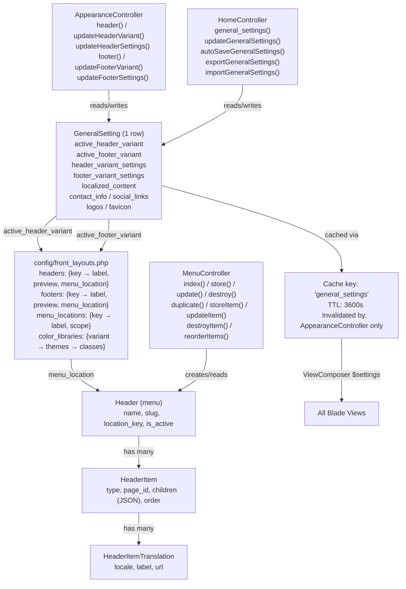

# Site Identity & Layout — General Settings, Appearance, and Menus

> **Last Updated:** 2026-06-16 · **Status:** Verified  
> **Source:** Code-first — `GeneralSetting`, `AppearanceController`, `HomeController`, `MenuController`, `Header`, `HeaderItem`, `config/front_layouts.php`  
> **Supersedes:** `_archive/legacy-docs/appearance-system.md`, `_archive/legacy-docs/general-settings-system.md`, `_archive/legacy-docs/menu-system.md`

---

## Purpose

This document is the authoritative reference for three tightly coupled admin systems that together control the public face of a Palgoals site:

- **General Settings** — site identity (title, logos, default language, contact, social)
- **Appearance** — header and footer visual variants, per-variant configuration, color themes
- **Menu** — navigation structures that are rendered inside header and footer variants

All three systems share a single database row in `general_settings`, a single cache key, and a single policy class. They are documented together because touching any one of them requires understanding all three.

---

## Domain Overview



The link between the three systems:

1. `GeneralSetting.active_header_variant` (e.g. `"purple_topbar"`) references a key in `config/front_layouts.headers`.
2. That config entry's `menu_location` (e.g. `"header_primary"`) tells the frontend which `Header` record to render.
3. The `Header` with `location_key = "header_primary"` provides the navigation structure.

This means switching a header variant may change which menu appears on the site, even without touching the menu system.

---

## Core Models

### `GeneralSetting`

**File:** `app/Models/GeneralSetting.php`  
**Table:** `general_settings`  
**Rows:** Always exactly 1. Created via `firstOrCreate([], [...])` in `AppearanceController::settings()`.

```
general_settings
├── id
├── site_title          string(255)        — Primary locale title (raw column, legacy fallback)
├── site_discretion     string(500)        — Primary locale description (raw column, legacy fallback)
├── logo                string             — Media path
├── dark_logo           string
├── sticky_logo         string
├── dark_sticky_logo    string
├── admin_logo          string
├── admin_dark_logo     string
├── favicon             string
├── default_language    FK → languages.id  — Drives locale fallback in resolveLocalizedValue()
├── active_header_variant  string          — FK to config/front_layouts.headers key
├── active_footer_variant  string          — FK to config/front_layouts.footers key
├── header_show_promo_bar  boolean
├── header_is_sticky       boolean
├── header_variant_settings  JSON array    — Per-variant configuration (see below)
├── footer_variant_settings  JSON array    — Per-variant configuration (see below)
├── footer_show_contact_banner  boolean
├── footer_show_payment_methods boolean
├── contact_info           JSON array      — {phone, email, address}
├── social_links           JSON array      — {facebook, twitter, linkedin, instagram, whatsapp}
├── localized_content      JSON array      — Multi-locale title/description/address
└── timestamps
```

**8 migrations** (chronological evolution):
1. `2025_06_17` — initial table (site_title, logo, favicon, default_language)
2. `2025_10_02` — added contact_info, social_links
3. `2026_03_04` — added active_header_variant, active_footer_variant
4. `2026_03_04` — added header_show_promo_bar, header_is_sticky, footer_show_contact_banner, footer_show_payment_methods
5. `2026_03_05` — added header_variant_settings (JSON)
6. `2026_03_07` — added footer_variant_settings (JSON)
7. `2026_03_08` — added localized_content (JSON)
8. `2026_05_08` — fixed default_language FK constraint

---

## General Settings System

### Settings Lifecycle

```
Admin visits /admin/general_settings
  → HomeController::general_settings()
  → GeneralSetting::first()             ← direct DB query (no cache used here)
  → view('dashboard.general-setting')

Admin saves form
  → POST /admin/general_settings/update
  → HomeController::updateGeneralSettings()
  → Validator::make() with multi-locale gs_texts
  → $setting->save()
  → ⚠ NO Cache::forget() called         ← see TD-2

Admin saves via autosave (AJAX)
  → POST /admin/general_settings/autosave
  → HomeController::autoSaveGeneralSettings()
  → Partial validation (all fields nullable)
  → $setting->save()
  → returns JSON {saved: bool, message: string}
  → ⚠ NO Cache::forget() called         ← see TD-2

AppearanceController saves header/footer variant
  → POST /admin/appearance/header/settings (or footer)
  → AppearanceController::updateHeaderSettings()
  → $this->settings()->update(...)
  → Cache::forget('general_settings')   ← only AppearanceController does this

ViewComposer (every request)
  → Cache::remember('general_settings', 3600, fn() => GeneralSetting::first())
  → $settings injected into every Blade view
```

### Localization Support

The `localized_content` JSON column holds per-language values for three fields:

```php
// Structure:
[
    'site_title'     => ['ar' => 'بالجول', 'en' => 'Palgoals'],
    'site_discretion'=> ['ar' => 'وصف عربي', 'en' => 'English description'],
    'contact_address'=> ['ar' => 'عنوان عربي', 'en' => 'English address'],
]
```

The `site_title` and `site_discretion` raw columns are preserved as a legacy fallback for the default locale. When reading a localized value, `GeneralSetting::resolveLocalizedContent(field)` applies this fallback chain:

1. `localized_content[$field][$currentLocale]`
2. `localized_content[$field][$defaultLanguageCode]` (from `default_language` FK)
3. `localized_content[$field][$fallbackLocale]` (from `config('app.fallback_locale')`)
4. First non-empty value across all locales
5. The raw column value (`site_title` or `site_discretion`)
6. The `$default` parameter passed to the method

**Computed attributes** (use these in Blade, never raw columns):

```blade
{{ $settings->resolved_site_title }}        {{-- locale-aware title --}}
{{ $settings->resolved_site_discretion }}   {{-- locale-aware description --}}
{{ $settings->resolved_contact_info['address'] }}  {{-- locale-aware address --}}
```

**Form field naming** (in the admin general settings form):

```html
<input name="gs_texts[ar][site_title]" ...>
<input name="gs_texts[en][site_title]" ...>
<input name="gs_texts[ar][site_discretion]" ...>
<input name="gs_texts[ar][contact_address]" ...>
```

---

## Appearance System

### The Role of `config/front_layouts.php`

**File:** `config/front_layouts.php`

This config file is the **schema registry** for the entire appearance system. It defines:

- Which header and footer variants exist
- Their labels, descriptions, and preview image paths
- Which `menu_location` each variant uses
- Color themes for variants that support them

> ⚠ **Critical:** Adding a new header or footer variant requires editing `config/front_layouts.php`. There is no admin UI for registering new variants. The validation in `AppearanceController` and `HomeController` uses `array_keys(config('front_layouts.headers', []))` — an unknown key will fail validation silently.

### Header Variants

Defined under `config/front_layouts.headers`:

| Key | Label | Description | Menu Location |
|-----|-------|-------------|---------------|
| `default` | Classic | Logo left, menu center, actions right | `header_primary` |
| `centered` | Centered | Brand + actions top, centered nav below | `header_primary` |
| `split` | Split Brand | Menu left, brand centered, actions right | `header_primary` |
| `purple_topbar` | Purple Topbar | Announcement strip + social + two-level nav | `header_primary` |

Default variant (if `active_header_variant` is null): `"default"` (from `config('front_layouts.defaults.header')`).

The `purple_topbar` variant supports **color themes** defined in `config/front_layouts.color_libraries.purple_topbar.themes`:

| Theme | Label |
|-------|-------|
| `classic` | Classic Purple |
| `slate` | Slate Cyan |
| `emerald` | Emerald Lime |
| `sunset` | Sunset Coral |
| `custom` | Custom (Manual) — uses CSS custom classes `pv-topbar-custom-*` |

### Footer Variants

Defined under `config/front_layouts.footers`:

| Key | Label | Description | Menu Location |
|-----|-------|-------------|---------------|
| `default` | Classic | Large marketing footer with CTA band, columns, payments | `footer_primary` |
| `compact` | Compact | Dense three-column footer | `footer_primary` |
| `stacked` | Stacked | Contact banner on top, minimal centered footer | `footer_primary` |
| `palgoals_marketing` | PalGoals Marketing | Three-column gray footer with pages, payments, social | `footer_primary` |

Default variant: `"default"` (from `config('front_layouts.defaults.footer')`).

The `palgoals_marketing` variant supports **color themes** defined in `config/front_layouts.color_libraries.palgoals_marketing.themes`:

| Theme | Label |
|-------|-------|
| `classic` | Classic Purple |
| `slate` | Slate Cyan |
| `emerald` | Emerald Lime |
| `sunset` | Sunset Coral |
| `custom` | Custom (Manual) — uses CSS custom classes `pf-marketing-custom-*` |

### Variant Settings Architecture

Per-variant configuration is stored in two JSON columns:

**`header_variant_settings`** — structure depends on active variant. For `purple_topbar`:

```json
{
  "pv_color_theme": "classic",
  "pv_texts": {
    "ar": { "announcement_text": "...", "login_label": "..." },
    "en": { "announcement_text": "...", "login_label": "..." }
  },
  "pv_logo_override": "path/to/logo.png",
  "pv_logo_width": 160,
  "pv_logo_height": 48,
  "pv_color_theme_custom": { ... }
}
```

**`footer_variant_settings`** — structure depends on active variant. For `palgoals_marketing`:

```json
{
  "fm_color_theme": "classic",
  "fm_texts": {
    "ar": { "description_text": "...", "pages_title": "...", "copyright_text": "..." },
    "en": { "description_text": "...", "pages_title": "...", "copyright_text": "..." }
  },
  "fm_logo_override": "path/to/logo.png",
  "fm_logo_width": 160,
  "fm_logo_height": 48,
  "fm_payment_logos": "...",
  "fm_show_social_icons": true
}
```

The full JSON schema for each variant is only derivable from the `Validator::make()` rules in `AppearanceController::updateHeaderSettings()` and `updateFooterSettings()`. There is no schema file or migration describing these structures.

### Appearance Routes

```
GET  /admin/appearance/header              dashboard.appearance.header
POST /admin/appearance/header/variant      dashboard.appearance.header.variant
POST /admin/appearance/header/settings     dashboard.appearance.header.settings

GET  /admin/appearance/footer              dashboard.appearance.footer
POST /admin/appearance/footer/variant      dashboard.appearance.footer.variant
POST /admin/appearance/footer/settings     dashboard.appearance.footer.settings
```

---

## Menu System

### Menu Locations

Defined under `config/front_layouts.menu_locations`:

| Key | Label | Scope |
|-----|-------|-------|
| `header_primary` | Header Primary | header |
| `header_topbar` | Header Topbar | header |
| `footer_primary` | Footer Primary | footer |
| `footer_secondary` | Footer Secondary | footer |
| `footer_bottom` | Footer Bottom / Legal | footer |

**Important:** Every current header variant uses `header_primary`. `header_topbar` and `footer_*` locations are available for menus but no active header variant declares them as its primary location. A `Header` record can be assigned to any location — the renderer decides which one to display.

### Models

**`Header`** — `app/Models/Header.php`  
Represents a named navigation menu.

```
headers
├── id
├── name          string(120)      — Display name, e.g. "Main Menu"
├── slug          string           — URL-safe unique identifier
├── location_key  string           — FK to config/front_layouts.menu_locations key
├── is_active     boolean
├── deleted_at    (SoftDeletes)
└── timestamps
```

Cascade behavior (via model boot):
- **Soft delete**: deletes all `HeaderItem` records belonging to this menu
- **Restore**: restores all soft-deleted items belonging to this menu

**`HeaderItem`** — `app/Models/HeaderItem.php`

```
header_items
├── id
├── header_id   FK → headers.id
├── type        string   — "link" | "page" | "dropdown"
├── page_id     FK → pages.id (nullable, used when type="page")
├── children    JSON     — array of child items (used when type="dropdown")
├── order       integer
├── deleted_at  (SoftDeletes)
└── timestamps
```

Key accessors:
- `$item->label` — locale-aware label (reads from `translations`, falls back to first available)
- `$item->url` — locale-aware URL (resolves page slug for `type="page"`, or reads translation URL)
- `$item->processed_children` — resolves dropdown children, fetching page slugs for page-type children

**`HeaderItemTranslation`** — `app/Models/HeaderItemTranslation.php`

```
header_item_translations
├── id
├── header_item_id  FK → header_items.id
├── locale          string
├── label           string
├── url             string (nullable — empty for page-type items)
└── timestamps
```

### Menu Routes

```
GET    /admin/menus                          dashboard.menus
POST   /admin/menus                          dashboard.menus.store
PATCH  /admin/menus/{menu}                   dashboard.menus.update
DELETE /admin/menus/{menu}                   dashboard.menus.destroy
POST   /admin/menus/{menu}/duplicate         dashboard.menus.duplicate
POST   /admin/menus/{menu}/items             dashboard.menus.items.store
PATCH  /admin/menus/{menu}/items/{item}      dashboard.menus.items.update
DELETE /admin/menus/{menu}/items/{item}      dashboard.menus.items.destroy
POST   /admin/menus/{menu}/items/reorder     dashboard.menus.items.reorder  (→ JSON)
GET    /admin/headers                        dashboard.headers  (→ redirect to dashboard.menus)
```

### Menu Builder Architecture

The menu builder is a **single-URL SPA-style page**. There are no separate create/edit routes. All state is controlled via query parameters:

```
GET /admin/menus?menu={id}               → select a menu to edit
GET /admin/menus?menu={id}&edit_item={id} → open the edit form for a specific item
```

On first visit, if no menus exist, `MenuController::index()` creates a "Main Menu" inside a DB transaction with a race-condition check:

```php
$menus = DB::transaction(function () {
    if (Header::query()->exists()) {
        return Header::query()->orderBy('name')->get();  // Re-check inside transaction
    }
    Header::query()->create(['name' => 'Main Menu', 'slug' => 'main-menu',
        'location_key' => 'header_primary', 'is_active' => true]);
    return Header::query()->orderBy('name')->get();
});
```

**`duplicate()`** performs a deep clone of a menu inside a DB transaction:

```php
// Creates new Header with name = "{original name} (Copy)"
// Copies all HeaderItems with their type, page_id, children, order
// Copies all HeaderItemTranslation records for each item
```

**`reorderItems()`** returns JSON (not a redirect). It accepts `ids[]` — an ordered array of item IDs — and updates the `order` column for each item inside a DB transaction. The frontend uses SortableJS to generate the reorder request.

---

## Rendering Flow

How a menu ends up displayed on a page:

```
1. AppServiceProvider ViewComposer injects:
   $settings = Cache::remember('general_settings', 3600, fn() => GeneralSetting::first())

2. Frontend layout reads:
   $settings->active_header_variant  →  e.g. "purple_topbar"

3. Blade layout loads the corresponding header partial:
   resources/views/front/layouts/headers/purple_topbar.blade.php

4. Header partial reads menu_location from config:
   config('front_layouts.headers.purple_topbar.menu_location')  →  "header_primary"

5. Header partial queries:
   Header::where('location_key', 'header_primary')->where('is_active', true)->first()
   → loaded with items.translations

6. Items are rendered in order, with locale-aware labels and URLs
```

---

## Cache Architecture

| Key | Set by | TTL | Cleared by |
|-----|--------|-----|------------|
| `'general_settings'` | `AppServiceProvider` ViewComposer | 3600s | `AppearanceController` (after variant/settings save) |
| `"lang_{$locale}"` | `AppServiceProvider` ViewComposer | 3600s | Not explicitly cleared |
| `'active_languages'` | `AppServiceProvider` ViewComposer | 3600s | Not explicitly cleared |

**Critical:** `Cache::forget('general_settings')` is called only inside `AppearanceController` (4 locations). `HomeController::updateGeneralSettings()` and `autoSaveGeneralSettings()` do **not** call it. This means saving site identity settings (title, logos, contact, social) leaves the cached `$settings` stale in all views for up to 3600 seconds. See TD-2.

---

## Export & Import

**Export** — `GET /admin/general_settings/export`

Produces a JSON file named `general-settings-{timestamp}.json`:

```json
{
  "meta": {
    "schema_version": 2,
    "exported_at": "2026-06-16T...",
    "app_url": "https://example.com"
  },
  "general_setting": {
    "site_title": "...",
    "logo": "path/to/logo.png",
    "active_header_variant": "purple_topbar",
    "header_variant_settings": { ... },
    "localized_content": { ... },
    ...
  }
}
```

> ⚠ **TD-3:** `footer_variant_settings` is **not** included in the export payload. Only `header_variant_settings` is exported. A settings import will not restore footer variant configuration.

**Import** — `POST /admin/general_settings/import`

Accepts a JSON or TXT file (max 2 MB). Validates against the same rules as `updateGeneralSettings`. If `schema_version` is present in the root, the importer reads from `decoded['general_setting']` key; otherwise reads the decoded root directly (v1 format compatibility).

---

## Autosave Workflow

The general settings page has an autosave mechanism separate from the main form save:

| | Main Save | Autosave |
|-|-----------|---------|
| Endpoint | `POST /admin/general_settings/update` | `POST /admin/general_settings/autosave` |
| Response | Redirect with flash | JSON `{saved: bool, message: string}` |
| `default_language` | `required` | `nullable` |
| `active_*_variant` | `required` | `nullable` |
| `gs_texts` site_title | Required for default locale | `nullable` |
| `Cache::forget` | ❌ Not called | ❌ Not called |

The autosave covers: logos/favicon, default_language, active variants, contact_info, social_links, and `gs_texts` (localized title/description/address).

---

## Security Considerations

All endpoints in this domain are protected by `GeneralSettingPolicy` (for settings/appearance) and `Header` policy (for menus). See `docs/24-security-notes.md` for policy architecture.

Key points:
- `authorize('view', GeneralSetting::class)` gates read access to settings and exports
- `authorize('update', GeneralSetting::class)` gates all writes and imports
- Hex color inputs are validated against `regex:/^#(?:[A-Fa-f0-9]{3}|[A-Fa-f0-9]{6})$/`
- Menu location keys are validated against `Rule::in(array_keys($locations))` from config
- `Header::destroy()` prevents deletion of the last menu: minimum 1 menu must remain

---

## Common Workflows

### Add a New Header Variant

1. Add the entry to `config/front_layouts.php` under `headers`:
   ```php
   'my_variant' => [
       'label'         => 'My Variant',
       'description'   => 'A custom header layout.',
       'preview'       => 'assets/front-layouts/previews/headers/my-variant.png',
       'menu_location' => 'header_primary',
   ],
   ```
2. Create the Blade partial at `resources/views/front/layouts/headers/my_variant.blade.php`
3. If the variant has configurable settings, add validation rules to `AppearanceController::updateHeaderSettings()` and defaults to `headerVariantDefaults()`
4. If it has color themes, add to `config/front_layouts.color_libraries.my_variant`

### Switch the Active Header or Footer

Navigate to `/admin/appearance/header` or `/admin/appearance/footer` in the admin panel. The variant selector POST to `dashboard.appearance.header.variant`. After switching, `Cache::forget('general_settings')` is called automatically.

### Create a Menu

Navigate to `/admin/menus` and use the "Create Menu" form. Provide a name and a location key. The slug is auto-generated. After creation, the page redirects to `?menu={new_id}`.

### Assign a Menu to a Location

Edit the menu (`PATCH /admin/menus/{menu}`) and change the `menu_location` field to any key from `config/front_layouts.menu_locations`. The active header/footer variant will pick up the change on the next request (after cache expiry or `Cache::forget`).

### Import Settings Between Environments

1. On the source environment: `/admin/general_settings/export` → download JSON
2. On the target environment: `/admin/general_settings` → "Import Settings" → upload the JSON file
3. Verify: logos are path-based strings — they must exist on the target server's media storage

---

## Technical Debt

**TD-1 — SetLocale bypasses cache (no fix yet)**  
`SetLocale` middleware calls `GeneralSetting::first()` on every web request without caching. This is a DB query per request for the sole purpose of resolving the default locale. Documented also in `docs/26-locale-system.md § TD-2`.

**TD-2 — HomeController writes do not invalidate cache**  
`HomeController::updateGeneralSettings()` and `autoSaveGeneralSettings()` save to the `general_settings` row but do NOT call `Cache::forget('general_settings')`. Only `AppearanceController` clears the cache. Consequence: saving site title, logos, contact info, or social links via the main settings form leaves all Blade views showing stale data for up to 3600 seconds.

**Fix:** Add `Cache::forget('general_settings')` before the redirect in both `updateGeneralSettings()` and after `$setting->save()` in `autoSaveGeneralSettings()`.

**TD-3 — footer_variant_settings excluded from export**  
The `exportGeneralSettings()` payload includes `header_variant_settings` but not `footer_variant_settings`. An environment transfer via export/import will lose all footer variant configuration (color theme, per-language texts, logo overrides).

**TD-4 — No admin UI for restoring soft-deleted menus or items**  
`Header` and `HeaderItem` use `SoftDeletes`. The cascade delete/restore logic is correctly implemented in the model. However, the admin panel has no interface for viewing or restoring deleted menus or items. Deleted records are permanently inaccessible via the UI.

**TD-5 — JSON settings schema not self-describing**  
The structure of `header_variant_settings` and `footer_variant_settings` is only derivable by reading the validation rules in `AppearanceController` (810 lines). There is no schema file, no migration comment, and no type definition. Adding a new field to a variant's settings requires updating validation, defaults, and the Blade view independently with no central schema to reference.

---

## Related Documents

| Topic | Document |
|-------|----------|
| Locale resolution and `t()` function | `docs/26-locale-system.md` |
| Auth guards and policy architecture | `docs/24-security-notes.md` |
| Media paths and media picker | `docs/27-media-library.md` (pending) |
| Database schema overview | `docs/03-database-architecture.md` |
| Coding standards and patterns | `docs/22-coding-standards.md` |
