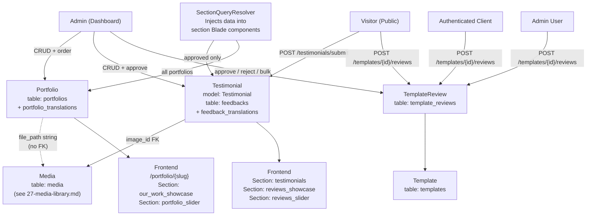

# Content Showcase System

> **Last Updated:** 2026-06-16 · **Status:** Verified  
> **Source:** Code-first — `Portfolio`, `Testimonial`, `TemplateReview`, all migrations, `PortfolioController`, `TestimonialsController`, `TestimonialSubmissionController`, `Front\TemplateReviewController`, `Admin\TemplateReviewController`, `SectionQueryResolver`

---

## Purpose

This document is the authoritative reference for the Content Showcase domain — the three subsystems used to display social proof and project evidence to website visitors: **Portfolio** (completed project gallery), **Testimonials** (customer reviews, stored in the `feedbacks` table), and **Template Reviews** (per-template ratings, a separate domain).

This document replaces the archived `portfolio-system.md` and `testimonial-system.md`.

---

## Domain Overview



---

## Content Types

| Content Type | Purpose | Public submission? | Approval required? | Translation support |
|---|---|---|---|---|
| **Portfolio** | Project gallery with images, details, links | ❌ Admin only | ❌ (no approval flag) | ✅ `portfolio_translations` |
| **Testimonial** | Customer reviews with star rating and photo | ✅ Visitor form | ✅ `is_approved` boolean | ✅ `feedback_translations` |
| **Template Review** | Per-template ratings with comment | ✅ Visitor / Client / User | ✅ `approved` boolean | ❌ Single language |

---

## Portfolio System

### Portfolio Model

**File:** `app/Models/Portfolio.php`  
**Table:** `portfolios`  
**Traits:** `SoftDeletes`

#### Schema

```
portfolios
├── id                         bigint PK
├── default_image              varchar(255) nullable   -- file_path string (not a media.id FK!)
├── images                     json nullable            -- JSON array of file_path strings
├── delivery_date              date
├── order                      integer
├── implementation_period_days integer nullable
├── slug                       varchar(255) nullable, unique
├── client                     varchar(255) nullable    -- client name (free text, no FK)
├── deleted_at                 timestamp nullable       -- SoftDeletes (migration 2026_05_05)
├── created_at
└── updated_at
```

#### Translation Schema (`portfolio_translations`)

```
portfolio_translations
├── id
├── portfolio_id   bigint FK → portfolios.id  CASCADE on delete
├── locale         varchar(255)               -- e.g. 'ar', 'en'
├── title          varchar(255)
├── description    text nullable
├── type           varchar(255)               -- project type (free text, e.g. "Web Design")
├── materials      varchar(255) nullable      -- tools/technologies used
├── link           varchar(2048) nullable     -- external project URL
├── status         varchar(100) nullable      -- free text (e.g. "مكتمل") — NOT enforced
├── created_at
└── updated_at
```

**Note on `status`:** The status field is a free-text string stored per-translation. It is **not** an enum and is **not** used by `SectionQueryResolver` to filter visibility. All portfolios appear on the frontend regardless of status value (see TD-3).

#### Key Relations

```php
$portfolio->translations   // HasMany PortfolioTranslation
$portfolio->translation()  // helper: returns translation for current locale
```

### Portfolio Lifecycle

```
Admin creates portfolio
    ↓
PortfolioController::store()
    ├─ authorize('create', Portfolio::class)
    ├─ loadLanguages() — lazy, once per request
    ├─ Validate: order, delivery_date, implementation_period_days, client
    │           default_image: nullable|integer|exists:media,id
    │           images: nullable|string|regex:/^(\d+)(,\d+)*$/
    │           translations.*: required|nullable by language activity
    ↓
resolveMediaIdsToPaths($validated['default_image'])
    — accepts single int or comma-separated ints
    — Media::find(id)?->file_path or Media::whereIn()->pluck('file_path')
    — returns path string or JSON-encoded array of paths
    ↓
DB::beginTransaction()
    ├─ generateUniqueSlug($titleForSlug)  (retry loop up to 3x on SQLSTATE 23000)
    ├─ Portfolio::create([...])           (all path strings, not IDs)
    └─ foreach translations → PortfolioTranslation::create([...])
DB::commit()
    ↓
Redirect → index with session('ok')
```

**Update:** Same flow, `Portfolio::update()` + `PortfolioTranslation::updateOrCreate()` per locale.

**Delete:** Soft-delete via `$portfolio->delete()`. Translation records are **not** soft-deleted — they cascade on hard delete only.

**Slug generation:** `Str::slug($title) ?: 'portfolio'`, loops with counter suffix until unique. Concurrent collision handled by catch-and-retry (max 3 attempts).

### Portfolio Media Handling

Portfolio images use **Pattern B (path strings)** from `docs/27-media-library.md`:

1. Admin opens media picker (`data-store-value="path"`)
2. Picker writes `file_path` string (e.g. `media/2026/06/abc.jpg`) into hidden input
3. Controller validates as `nullable|integer|exists:media,id` — accepts an integer ID
4. `resolveMediaIdsToPaths()` converts integer ID → `file_path` string
5. Path string is stored in `portfolios.default_image` (varchar) or in `portfolios.images` (JSON array)

**Gallery images** (`images` column): submitted as comma-separated IDs (e.g. `"42,17,9"`), validated by regex, stored as JSON array of paths.

**Frontend URL resolution:**
```php
// Single image:
asset('storage/' . $portfolio->default_image)

// Gallery:
foreach (json_decode($portfolio->images, true) as $path) {
    asset('storage/' . $path)
}
```

`SectionQueryResolver` handles this via `portfolioImageUrl()`:
- Full URL → returns as-is
- Starts with `/` → returns as-is
- Starts with `storage/` → `asset($value)`
- Otherwise → `asset('storage/' . ltrim($value, '/'))`

**No FK constraint** exists between `portfolios.default_image` and `media`. Deleting a Media record leaves dead paths in portfolios silently.

---

## Testimonial System

### Testimonial Model

**File:** `app/Models/Testimonial.php`  
**Table:** `feedbacks` ⚠️ — see TD-1  
**Traits:** `SoftDeletes`

#### Schema (`feedbacks` table)

```
feedbacks
├── id
├── image_id      bigint nullable FK → media.id  nullOnDelete  ← actual FK constraint
├── star          integer nullable        -- rating 1-5
├── order         integer DEFAULT 0      -- display order
├── is_approved   boolean DEFAULT true   -- visibility flag
├── deleted_at    timestamp nullable     -- SoftDeletes (migration 2026_05_05)
├── created_at
└── updated_at
```

#### Translation Schema (`feedback_translations`)

```
feedback_translations
├── id
├── feedback_id   bigint FK → feedbacks.id  CASCADE on delete
├── locale        varchar(255)
├── feedback      varchar(255)  -- the testimonial text ⚠️ named 'feedback', not 'text'
├── name          varchar(255)  -- reviewer's name
├── major         varchar(255)  -- reviewer's title / profession
├── created_at
└── updated_at
```

#### Key Relations and Accessors

```php
$testimonial->translations   // HasMany TestimonialTranslation (FK: feedback_id)
$testimonial->translation()  // helper: returns translation for current locale
$testimonial->image          // BelongsTo Media (via image_id)
$testimonial->image_url      // accessor: $this->image?->url (null-safe)
```

#### Scopes

```php
Testimonial::approved()  // where('is_approved', true)
```

### Testimonial Lifecycle

**Admin-created testimonial:**

```
Admin fills form (star, order, is_approved, image, translations per language)
    ↓
TestimonialsController::store()
    ├─ authorize('create', Testimonial::class)
    ├─ validateTestimonialRequest():
    │   ├─ order: required|integer|min:1
    │   ├─ star: nullable|integer|min:1|max:5
    │   ├─ featured_image_id: nullable|integer|exists:media,id
    │   ├─ is_approved: nullable|boolean
    │   ├─ testimonialTranslations.*: locale, feedback, name, major (all nullable)
    │   └─ Custom rule: at least one COMPLETE translation (all 3 fields non-empty)
    ↓
DB::beginTransaction()
    ├─ Testimonial::create([image_id, star, order, is_approved])
    │   → is_approved defaults to true when not submitted
    └─ foreach extractCompleteTranslations() → TestimonialTranslation::create()
DB::commit()
    ↓
Redirect → index with session('ok')
```

**`extractCompleteTranslations()`:** Filters out partial translations — a translation row is only created if all three fields (feedback, name, major) are non-empty.

**Update:** `TestimonialTranslation::updateOrCreate()` + deletes translations for locales not in the submitted set.

**Delete:** Soft-delete. Translation records cascade via DB FK on hard-delete.

**`is_approved` default on admin create:** `true` (admin-created testimonials are approved immediately unless explicitly set to `false`).

---

## Feedback System

### What is the "Feedback" system?

**There is no separate `Feedback` model or `Feedbacks` domain.** The `feedbacks` table IS the testimonials table. The `Testimonial` model maps directly to `feedbacks`:

```php
class Testimonial extends Model
{
    protected $table = 'feedbacks';  // ← the table is named 'feedbacks'
    // ...
}
```

This naming inconsistency permeates the codebase:
- Table: `feedbacks`
- Translation table: `feedback_translations`
- FK column in translations: `feedback_id`
- Translation text column: `feedback` (the review text itself)
- Model class: `Testimonial`
- Controller: `TestimonialsController`

See TD-1 and TD-2 for full details.

### Public Submission Flow

Visitors can submit testimonials via a public form, which creates a record with `is_approved = false`:

```
Visitor navigates to GET /testimonials/submit
    ↓
TestimonialSubmissionController::create()
    → view('front.testimonials.submit', ['languages' => active languages])
    → abort_if(no active languages, 404)
    ↓
Visitor fills form (single language choice):
    name, major, feedback, star (1-5), language (select), image (optional upload)
    ↓
POST /testimonials/submit
    ↓
TestimonialSubmissionController::store()
    ├─ Validate:
    │   name: required|string|max:255
    │   major: required|string|max:255
    │   feedback: required|string
    │   star: required|integer|min:1|max:5
    │   language: required|string|in:[active locale codes]
    │   image: nullable|image|max:2048
    ↓
DB::beginTransaction()
    ├─ If image uploaded:
    │   $file->store('testimonials', 'public')  ← path: testimonials/xxx.jpg ⚠️ (see TD-5)
    │   Media::create([...])                    ← creates a Media record
    │   $imageId = $media->id
    │
    ├─ Testimonial::create([
    │       order: max(order)+1,
    │       star: $validated['star'],
    │       is_approved: false,              ← always false for public submissions
    │       image_id: $imageId              ← integer FK to media
    │   ])
    │
    └─ TestimonialTranslation::create([
           feedback_id: $testimonial->id,
           locale: $validated['language'],  ← single language only
           feedback: $validated['feedback'],
           name: $validated['name'],
           major: $validated['major'],
       ])
DB::commit()
    ↓
Redirect → testimonials.submit with session('ok')
    (or rollback + delete uploaded file on failure)
```

**Key differences from admin-created testimonials:**
- `is_approved = false` always — requires admin moderation before appearing on frontend
- Single-language submission (visitor picks one language)
- Image goes through `$file->store('testimonials', 'public')` — different path than `media/YYYY/MM/`

### Moderation Flow

Once a testimonial is submitted publicly, an admin must approve it:

```
Admin navigates to Dashboard → Testimonials
    ↓
TestimonialsController::index()
    → Shows all testimonials including is_approved=false
    → Search by translations.name or translations.major
    ↓
Admin clicks Edit
    ↓
TestimonialsController::edit() / update()
    → Sets is_approved = true/false (radio buttons in form)
    ↓
Approved testimonials appear on frontend (via SectionQueryResolver::testimonials())
```

There is **no dedicated single-click approve action** for testimonials — approval is done through the full edit form. Compare with TemplateReview which has a dedicated `approve()` / `reject()` endpoint (see below).

---

## Template Reviews

Template Reviews are a **separate domain** from Testimonials. They are tied to specific templates in the catalog, not to the site-wide showcase. They belong to the Template domain but are documented here because they share the "social proof / user-generated content" pattern.

### Review Schema

```
template_reviews
├── id
├── template_id    bigint FK → templates.id  CASCADE on delete
├── user_id        bigint nullable FK → users.id    nullOnDelete
├── client_id      bigint nullable FK → clients.id  nullOnDelete
├── author_name    varchar(191) nullable   -- guest reviewer
├── author_email   varchar(191) nullable   -- guest reviewer
├── rating         tinyint unsigned        -- 1..5, NOT NULL
├── comment        text                    -- NOT NULL, min 5 chars
├── approved       boolean DEFAULT false   -- requires admin approval
├── deleted_at     timestamp nullable      -- SoftDeletes (migration 2026_05_15)
├── created_at
└── updated_at
```

**Indexes:** `[template_id, approved, created_at]` and `[template_id, rating]`

**No image support** — TemplateReview has no media relation.

**No translation support** — single language per record.

### Review Workflow

**Submitter types** (mutually exclusive, set by controller based on auth state):

| Auth state | Fields set |
|---|---|
| Logged-in admin user | `user_id = auth()->id()` |
| Logged-in client | `client_id = auth('client')->id()` |
| Guest (no session) | `author_name`, `author_email` (both required) |

**Public submission (`POST /templates/{template_id}/reviews`):**

```php
Front\TemplateReviewController::store()
    ├─ Template::findOrFail($template_id)
    ├─ Detect submitter type (user / client / guest)
    ├─ Validate:
    │   rating:  required|integer|between:1,5
    │   comment: required|string|min:5|max:2000
    │   author_name:  required (guest only) |string|max:191
    │   author_email: required (guest only) |email|max:191
    ├─ TemplateReview::create([...approved: false])
    └─ back()->with('success', hardcoded string)  ← ⚠️ see TD-4
```

**Admin moderation (`/admin/templates/{id}/reviews/*`):**

| Route | Method | Action |
|---|---|---|
| `GET /reviews` | `index()` | List with search (comment, author, client name/email), approval filter, rating filter |
| `PATCH /reviews/{id}/approve` | `approve()` | Set `approved = true` |
| `PATCH /reviews/{id}/reject` | `reject()` | Set `approved = false` |
| `DELETE /reviews/{id}` | `destroy()` | Soft-delete |
| `POST /reviews/bulk` | `bulk()` | Approve / reject / delete multiple (DB transaction) |

**Dedicated approve/reject endpoints** — no need to open an edit form, unlike Testimonials.

**Model scopes:**

```php
TemplateReview::approved()  // where('approved', true)
```

**Model relations:**

```php
$review->template   // BelongsTo Template
$review->user       // BelongsTo User (withDefault — safe if null)
$review->client     // BelongsTo Client (withDefault — safe if null)
```

---

## Translation Support

### Portfolio

Full multilingual support via `portfolio_translations`. Every text field (title, type, materials, description, link, status) is per-language. The model provides `translation($locale)` helper that falls back to `firstWhere('locale', app()->getLocale())`.

Validation enforces translations for **active** languages (required) and makes them nullable for inactive languages.

### Testimonial

Full multilingual support via `feedback_translations`. Text fields: `feedback` (the review text), `name`, `major`. Admin can fill all active languages at once. Public submission accepts a **single language** chosen by the visitor.

### Template Review

**No translation support.** `comment` is a single-language `text` column. Reviewers write in whatever language they choose; there is no locale binding.

---

## Media Integration

See `docs/27-media-library.md` for full media architecture. Summary for this domain:

| Module | Storage | Pattern | FK? |
|---|---|---|---|
| Testimonial `image_id` | `media.id` integer | Pattern A (ID) | ✅ `constrained('media')->nullOnDelete()` |
| Portfolio `default_image` | `file_path` string | Pattern B (Path) | ❌ no FK |
| Portfolio `images` | JSON array of `file_path` strings | Pattern B (Path) | ❌ no FK |
| Public testimonial upload | Media record created, stored under `testimonials/` | Pattern A (ID via `image_id`) | ✅ (same FK) |
| Template Review | — | No media | — |

---

## Frontend Rendering

### Section Types and Data Injection

`SectionQueryResolver` (`app/Support/Sections/SectionQueryResolver.php`) is the central class that injects showcase data into section Blade components. It is called from the CMS rendering pipeline for every page section.

| Section type string | Method called | Data key injected | Filter applied |
|---|---|---|---|
| `testimonials` | `testimonials()` | `$data['testimonials']` | `is_approved = true` |
| `reviews_showcase` | `testimonials()` | `$data['testimonials']` | `is_approved = true` |
| `reviews_slider` | `reviewsSlider()` | `$data['reviews_items']` (mapped array) | `is_approved = true` (schema-defensive) |
| `our_work_showcase` | `portfolios()` | `$data['portfolios']` | **None** — all portfolios shown |
| `portfolio_slider` | `portfolioShowcase()` | `$data['portfolio_items']` (mapped array) | optional `is_active` if column exists |
| `portfolio_showcase` | `portfolioShowcase()` | `$data['portfolio_items']` (mapped array) | optional `is_active` if column exists |

**Testimonial query (simplified):**
```php
Testimonial::approved()
    ->with(['translations', 'image'])
    ->orderBy('order')
    ->get()
```

**Portfolio query (simplified):**
```php
Portfolio::query()
    ->with('translations')
    ->orderBy('order')
    ->orderByDesc('id')
    ->get()
```

### Portfolio Detail Page

```
GET /portfolio/{slug}
    ↓
Closure in routes/web.php:
    Portfolio::with(['translations'])->where('slug', $slug)->firstOrFail()
    → view('front.pages.portfolio', ['portfolio' => $portfolio])
```

URL falls back to `portfolio->id` when `slug` is null (`SectionQueryResolver::portfolioUrl()`).

### Testimonial Data Flow in Blade

In section Blade views (e.g. `testimonials.blade.php`):

```php
$testimonials = collect($data['testimonials'] ?? []);
// Each item is a full Testimonial model with relations eager-loaded

$translation = $testimonial->translations
    ->firstWhere('locale', app()->getLocale())
    ?? $testimonial->translations->first();

$imageUrl = $testimonial->image?->url ?? asset('assets/images/user1.webp');
```

In `reviews_slider` (mapped payload):
```php
$item['name']     // string
$item['position'] // string (= major)
$item['image']    // URL string or ''
$item['rating']   // int 1-5
$item['text']     // string (= feedback)
```

---

## Search & Filtering

### Admin Portfolio Search

Server-side, via `PortfolioController::index()`:
- Search on `portfolio_translations.title`, `portfolio_translations.type`, `portfolios.client`
- `per_page`: 10 / 25 / 50 (default 10)
- Order: always `portfolios.order ASC`

### Admin Testimonial Search

Server-side, via `TestimonialsController::index()`:
- Search on `feedback_translations.name`, `feedback_translations.major`
- `per_page`: 10 / 25 / 50 (default 10)
- Order: `order ASC, id ASC`

### Admin Template Review Search / Filter

Server-side, via `Admin\TemplateReviewController::index()`:
- Text search on: `comment`, `author_name`, `author_email`, client name/email (via relation), user name/email (via relation)
- Filter by `approved` (null / true / false)
- Filter by `rating` (1-5)
- Always `latest()` order (created_at DESC)
- Fixed 20 per page

### Frontend Filtering

No frontend filtering implemented currently. `SectionQueryResolver` supports a `limit` parameter and `show_featured_only` flag (for `portfolio_showcase` / `reviews_slider`) but there is no client-side or server-side category/tag filtering on the public portfolio or testimonials pages. The `portfolioShowcase()` method also supports `category_id` filtering but only if a `category_id` column exists on `portfolios` — it does not.

---

## Security Considerations

See `docs/24-security-notes.md` for the policy architecture.

- `PortfolioController`: authorizes via `PortfolioPolicy` — `viewAny`, `create`, `update`, `delete`
- `TestimonialsController`: authorizes via `TestimonialPolicy` — `viewAny`, `create`, `update`, `delete`
- `Admin\TemplateReviewController`: authorizes `viewAny`, `approve`, `reject`, `delete`, `bulk`
- `Front\TestimonialSubmissionController`: **no auth check** — public endpoint, rate limiting should be considered
- `Front\TemplateReviewController`: **no auth check** — open to all. Guest requires name+email; logged-in users skip those fields
- Public testimonial image upload: validated as `nullable|image|max:2048` (2 MB). SVG not accepted (no `svg` in mimes). Only standard image formats.

---

## Common Workflows

### Add a New Portfolio Item

1. Admin → Portfolios → Add Portfolio
2. Upload default image via media picker (`storeValue="path"`)
3. Optionally upload gallery images (multiple picker)
4. Fill order, delivery_date, client name
5. Fill translations for each active language (title, type, materials, link, status)
6. Save — item appears on frontend immediately (no approval step)

### Approve a Public Testimonial Submission

1. Visitor submits via `/testimonials/submit` → `is_approved = false`
2. Admin → Testimonials → finds the new testimonial (appears in list)
3. Admin clicks Edit
4. Sets `is_approved` to "Approved" radio button
5. Saves → `is_approved = true` → appears on frontend via `Testimonial::approved()` scope

### Add a Direct (Admin-Created) Testimonial

1. Admin → Testimonials → Add Testimonial
2. Upload image via media picker (`storeValue="id"` → `image_id` FK)
3. Set star rating, order, approval status (defaults to approved)
4. Fill translations (at least one complete translation required)
5. Save → appears on frontend immediately if `is_approved = true`

### Moderate Template Reviews

1. Admin → Templates → Reviews (tab or sidebar link)
2. Use search to find reviews, filter by approval status or rating
3. Click "Approve" button on individual rows, or bulk-select and use Bulk Approve
4. Approved reviews become visible on the template detail page

---

## Technical Debt

**TD-1 — `Testimonial` model maps to `feedbacks` table**

The `Testimonial` model uses `protected $table = 'feedbacks'`. This means the table, the translation table (`feedback_translations`), the FK column (`feedback_id`), and the migration files all say "feedback" while the model, controller, policy, and admin views all say "testimonial". This naming confusion is deeply embedded and any rename would require a migration + mass rename across the codebase.

```php
class Testimonial extends Model
{
    protected $table = 'feedbacks'; // ← hardcoded mismatch
}
class TestimonialTranslation extends Model
{
    protected $table = 'feedback_translations'; // ← same mismatch
    protected $fillable = ['feedback_id', ...]; // ← FK named feedback_id
}
```

**TD-2 — `feedback_translations.feedback` column stores testimonial text**

The column that stores the actual testimonial text is named `feedback` (same as the table prefix). Reading the schema, `feedback_translations.feedback` is the review text, not a reference to the feedbacks table. Should have been named `text` or `body`.

**TD-3 — Portfolio has no visibility control at the DB/query level**

There is no `is_active`, `is_approved`, or similar column on `portfolios`. The `status` field exists only in `portfolio_translations` as a free-text string and is never read by `SectionQueryResolver::portfolios()`. All portfolios, regardless of status string value, appear on the frontend. The `portfolioShowcase()` method supports `is_active` filtering but only if that column exists — it does not currently exist.

**TD-4 — `Front\TemplateReviewController` uses hardcoded `'success'` flash key**

```php
return back()->with('success', 'تم استلام مراجعتك ...');
// Should be:
return back()->with('ok', t('site.Review_Received', '...'));
```

Inconsistent with the project standard (`session('ok')`) and not using `t()`.

**TD-5 — Public testimonial image upload uses non-standard storage path**

`TestimonialSubmissionController` stores uploaded images under `testimonials/` (flat directory):

```php
$path = $file->store('testimonials', 'public');
// → storage/app/public/testimonials/randomhash.jpg
```

`MediaController::saveMediaFile()` uses `media/YYYY/MM/` with `uniqid()` naming. The paths stored in the `feedbacks` table via public submission (`testimonials/xxx.jpg`) do not follow the standard `media/YYYY/MM/` structure.

**TD-6 — Testimonial soft-delete does not cascade to `feedback_translations`**

`$testimonial->delete()` soft-deletes the `feedbacks` row (`deleted_at`). The `feedback_translations` table has a FK with `ON DELETE CASCADE` — but that only fires on **hard delete**, not soft delete. After soft-delete, `feedback_translations` rows remain orphaned until the record is permanently deleted. A `deleting` model event could cascade the soft-delete to translations.

---

## Future Improvements

1. **Portfolio visibility flag** — add `is_active` boolean to `portfolios` and use it in `SectionQueryResolver::portfolios()`.
2. **Table rename** — `feedbacks` → `testimonials`, `feedback_translations` → `testimonial_translations`. Requires coordination with all FK references and migration.
3. **One-click testimonial approve** — add a dedicated `PATCH /admin/testimonials/{id}/approve` endpoint (matching the TemplateReview pattern) so moderators don't need to open the full edit form.
4. **Public testimonial image path standardization** — route uploaded images through `MediaController::saveMediaFile()` or use the same `media/YYYY/MM/` convention.
5. **Rate limiting** — apply `throttle` middleware to the public submission routes (`testimonials.submit.store`, `templates.reviews.store`).
6. **Soft-delete cascade for testimonial translations** — add a `deleting` model event on `Testimonial` to soft-delete (or at minimum track) `feedback_translations`.

---

## Related Documents

| Topic | Document |
|---|---|
| Media storage patterns (ID vs path) | `docs/27-media-library.md` |
| Section rendering pipeline | `docs/07-section-definitions.md` |
| Authentication (policies, guards) | `docs/24-security-notes.md` |
| CMS page rendering | `docs/09-rendering-flow.md` |
| Coding standards (flash keys, t()) | `docs/22-coding-standards.md` |
